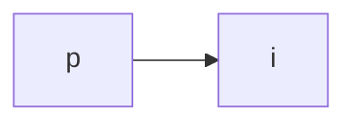
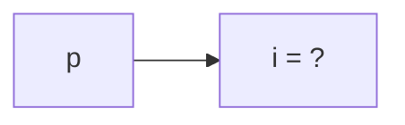
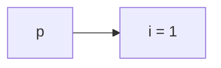
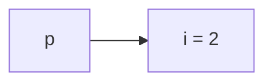
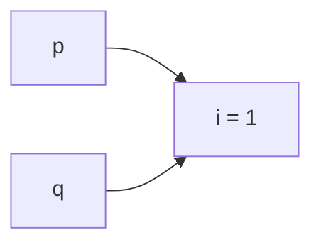
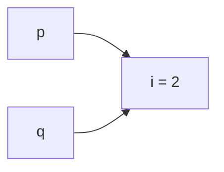
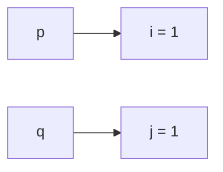

<h1 align="center"> Struct e Ponteiros</h1>

<p align="center">
  <a href="https://github.com/furlanxzx/Algoritmo-e-Estrutura-de-Dados-1/blob/main/02%20%E2%80%A2%20Manipula%C3%A7%C3%A3o%20de%20Arquivos/README.md">
    
  </a>
  &nbsp;&nbsp;&nbsp;&nbsp;
  <a href="../README.md">
    
  </a>
  &nbsp;&nbsp;&nbsp;&nbsp;
  <a href="https://github.com/furlanxzx/Algoritmo-e-Estrutura-de-Dados-1/blob/main/04%20%E2%80%A2%20Array%20e%20Ponteiros/README.md">
    
  </a>
</p>

---

Diferente dos vetores (*arrays*), que armazenam uma sequência de dados do **mesmo tipo**, as **estruturas** (`struct`) permitem agrupar variáveis de **tipos diferentes** sob um único nome.

---

## 📌 Conceitos Fundamentais

* **Registro:** É o nome dado à estrutura completa em outras linguagens de programação.
* **Membros ou Campos:** São as variáveis individuais contidas dentro da estrutura.

---

## <mark> 1 - Sintaxe e Formas de Declaração </mark>

Existem três formas principais de definir e utilizar estruturas em C:

### 1. Declaração Padrão (`struct`)
Define o modelo da estrutura e permite declarar variáveis usando a palavra-chave `struct`.

```c
// Definição do tipo
struct Cliente {
    char nome[30];
    char rua[50];
    int idade;
};

// Declaração de variáveis
struct Cliente voce;
struct Cliente eu;
```

---

### 2. Uso com `typedef` (Recomendado)
O `typedef` cria um **apelido** (*alias*) para o tipo de dado, eliminando a necessidade de repetir a palavra `struct` em toda declaração.

```c
typedef struct {
    int a1;
    int a2;
} TipoVetor;

// Declaração limpa de variáveis
TipoVetor v1, v2;
```

---

### 3. Estruturas Anônimas
Cria variáveis diretamente na definição da estrutura sem dar um nome ao tipo.

> ⚠️ **Atenção:** Estruturas anônimas **não podem** ser reutilizadas em outras partes do código para declarar novas variáveis.

```c
struct {
    int a1;
    int a2;
} vetor1, vetor2; // Apenas vetor1 e vetor2 existirão com este tipo
```

---

##  <mark> 2 - Acesso aos Campos </mark>

O acesso a cada membro de uma estrutura é feito através do **operador ponto (`.`)**.

```c
TipoVetor v1;
v1.a1 = 10; // Atribui valor ao campo 'a1'
v1.a2 = 20; // Atribui valor ao campo 'a2'
```

---

## <mark> 3 - Estruturas Aninhadas (Struct dentro de Struct) </mark>

Um membro de uma estrutura pode ser outra estrutura, desde que a estrutura interna tenha sido declarada previamente.

```c
typedef struct {
    char rua[35];
    int numero;
    char cep[10];
} Endereco;

typedef struct {
    char nome[45];
    Endereco ender; // Struct Endereco como membro
    float salario;
} Ficha;

int main() {
    Ficha pessoa;
    
    // Acesso encadeado usando o operador ponto
    pessoa.ender.numero = 100;
    
    return 0;
}
```

---

## 📝 Exercícios Práticos

---

### 🟢 Exercício 1: Criação de Tipos e Aninhamento

> **Enunciado:**  
> Escreva um trecho de código para fazer a criação dos novos tipos de dados conforme solicitado:
> 1. **Horário:** composto de hora, minutos e segundos.
> 2. **Data:** composto de dia, mês e ano.
> 3. **Compromisso:** composto de uma data, um horário e um texto descritivo.

<details>
<summary><b>💡 Clique aqui para ver a solução</b></summary>

<br>

```c
#include <stdio.h>

// 1. Tipo Horario
typedef struct {
    int hora;
    int minutos;
    int segundos;
} Horario;

// 2. Tipo Data
typedef struct {
    int dia;
    int mes;
    int ano;
} Data;

// 3. Tipo Compromisso (com structs aninhadas)
typedef struct {
    Data data;
    Horario horario;
    char descricao[100];
} Compromisso;

int main() {
    Compromisso reuniao;

    // Exemplo de preenchimento dos dados
    reuniao.data.dia = 15;
    reuniao.data.mes = 9;
    reuniao.data.ano = 2026;

    reuniao.horario.hora = 14;
    reuniao.horario.minutos = 30;
    reuniao.horario.segundos = 0;

    return 0;
}
```

</details>

---

### 🟡 Exercício 2: Vetor de Estruturas (Cadastro de CDs)

> **Enunciado:**  
> Faça um programa que utilize uma estrutura do tipo `CD` e faça a leitura de dados de 10 CDs (utilizando um vetor de estruturas). A estrutura `CD` deve conter os seguintes campos:
> * Nome da banda
> * Data do lançamento do CD (dia, mês e ano)
> * Data da contratação da empresa (dia, mês e ano)
> * Valor do CD
> * Número de membros da banda
> * Produtora do CD

<details>
<summary><b>💡 Clique aqui para ver a solução</b></summary>

<br>

```c
#include <stdio.h>

#define QTD_CDS 10

// Struct reutilizável para datas
typedef struct {
    int dia;
    int mes;
    int ano;
} Data;

// Struct principal para o CD
typedef struct {
    char nome_banda[50];
    Data data_lancamento;
    Data data_contratacao;
    float valor;
    int num_membros;
    char produtora[50];
} CD;

int main() {
    CD colecao[QTD_CDS];

    printf("CADASTRO DE %d CDs\n", QTD_CDS);

    for (int i = 0; i < QTD_CDS; i++) {
        printf("CD nº %d\n", i + 1);

        printf("Nome da banda: ");
        scanf(" %[^\n]", colecao[i].nome_banda);

        printf("Data de lancamento (dia mes ano): ");
        scanf("%d %d %d", &colecao[i].data_lancamento.dia, 
                          &colecao[i].data_lancamento.mes, 
                          &colecao[i].data_lancamento.ano);

        printf("Data de contratacao (dia mes ano): ");
        scanf("%d %d %d", &colecao[i].data_contratacao.dia, 
                          &colecao[i].data_contratacao.mes, 
                          &colecao[i].data_contratacao.ano);
```
</details>

---

<h1 align="center">Ponteiros</h1>

## <mark> 1 - Definição </mark>

**Ponteiro** é uma variável que armazena um **endereço de memória**.

Deve ser declarado usando o símbolo `*`:

```c
int *p;
```

- `p` é o nome da variável que armazenará um endereço de memória;
- `int *` informa ao compilador que `p` armazenará um endereço de memória em que será guardado um número inteiro.

---

## <mark> 2 - Declaração </mark>

É possível declarar ponteiro junto com outras variáveis:

```c
int i, *p, j, v[10], *q;
```

📌 Repare que o `*` é ligado à **variável**, não ao tipo: em `int i, *p, j, v[10], *q;`, só `p` e `q` são ponteiros — `i`, `j` e `v` são variáveis comuns.

---

## <mark> 3 - Operadores </mark>

Há dois operadores usados com ponteiros:

- **Operador de endereço `&`**
  - Se `x` é variável, então `&x` é o endereço de memória de `x`.
- **Operador indireto `*`**
  - Se `p` é um ponteiro, então `*p` é o conteúdo armazenado no endereço que `p` guarda.

---

## <mark> 4 - Ponteiro não inicializado </mark>

Declarar uma variável ponteiro reserva espaço na memória para o apontador, mas **não faz referência a nenhum objeto**:

```c
int *p; // não guarda nada ainda
```


Para usar `p`, primeiro é necessário **inicializá-lo** ou **alocar** um espaço de memória para que ele receba o endereço desse espaço alocado:

```c
int *p, i;
...
p = &i;
```

ou

```c
int i, *p = &i;
```



---

## <mark> 5 - Ponteiro nulo </mark>

É possível inicializar um ponteiro vazio fazendo:

```c
int *p;
p = NULL;  // NULL é definida em stdlib.h
```

Uma vez que o ponteiro aponta para um objeto, é possível usar o operador `*` para acessar seu conteúdo:

```c
printf("%d\n", *p); // imprime o conteúdo armazenado no endereço que p guarda
```

Se `p` aponta para `i`, `*p` é dito ser um ***alias*** de `i`:

- `*p` tem o mesmo valor que `i`;
- alterar `*p` também altera o valor de `i`.

---

## <mark> 6 - Exemplo passo a passo </mark>

Acompanhe como o conteúdo de `i` e `*p` evoluem:

```c
p = &i;
```



```c
i = 1;
```



```c
printf("%d\n", i);  /* imprime 1 */
printf("%d\n", *p); /* imprime 1 */
```

Como `p` aponta para `i`, alterar `*p` altera `i` diretamente:

```c
*p = 2;
```



```c
printf("%d\n", i);  /* imprime 2 */
printf("%d\n", *p); /* imprime 2 */
```

---

## <mark> 7 - Cuidados </mark>

⚠️ **Nunca aplique um operador indireto (`*`) em um apontador não inicializado.**

```c
int *p;
printf("%d\n", *p);
```

Pode causar um comportamento indefinido.

⚠️ **Nunca atribua um valor que não seja um endereço a uma variável do tipo ponteiro**, pois poderá travar o sistema.

```c
int *p;
p = 1; // NUNCA FAÇA ISSO!!
```

---

## <mark> 8 - Copiando endereços </mark>

C permite que o operador de atribuição copie endereços:

```c
int i, j, *p, *q;
p = &i; // endereço de i é copiado para p
q = p;  // endereço que p guarda é copiado para q
```

Tanto `p` quanto `q` agora apontam para `i` (guardam o endereço de memória de `i`):


Agora é possível alterar o valor de `i` atribuindo novos valores para `*p` e `*q`:

```c
*p = 1;
```



```c
*q = 2;
```



📌 Qualquer número de ponteiros pode apontar para o mesmo objeto.

---

## <mark> 9 - `p = q` vs `*q = *p` </mark>

⚠️ **Cuidado!!! Não confunda:**

```c
p = q;
```

com

```c
*q = *p;
```

O primeiro é uma **atribuição de ponteiro** (faz `q` passar a apontar para o mesmo lugar que `p`), enquanto o segundo **não é uma atribuição direta de ponteiro** — é uma atribuição do *valor apontado*.

**Exemplo com `*q = *p`:**

```c
p = &i;
q = &j;
i = 1;
*q = *p;
```



`*q = *p` **copia o valor** da variável apontada por `p` (o valor de `i`) para dentro do objeto apontado por `q` (a variável `j`) — `p` e `q` continuam apontando para endereços **diferentes**, só o conteúdo de `j` mudou.

---

<h1 align="center">Alocação Dinâmica</h1>

A **alocação dinâmica** permite reservar memória durante a execução do programa (*runtime*), ao contrário da alocação estática (como vetores com tamanho fixo). Todas as funções de alocação dinâmica pertencem à biblioteca `<stdlib.h>`.

---

## <mark> 1 - Funções Principais (`<stdlib.h>`) </mark>

| Função | Assinatura | Descrição |
| :--- | :--- | :--- |
| **`malloc`** | `void *malloc(size_t size);` | Aloca um bloco contínuo de memória com o tamanho especificado em bytes. Conteúdo inicial indeterminado (lixo de memória). |
| **`calloc`** | `void *calloc(size_t n_element, size_t size);` | Aloca memória para N elementos de determinado tamanho e **inicializa todos os bytes com zero**. |
| **`realloc`** | `void *realloc(void *ptr, size_t size);` | Altera o tamanho de um bloco de memória previamente alocado. |
| **`free`** | `void free(void *ptr);` | Libera o bloco de memória alocado dinamicamente de volta para o sistema operacional. |

---

##  <mark> 2 - Conceitos Fundamentais </mark>

### <mark> 2.1 O Retorno `void *` e o Cast Tipo de Ponteiro </mark>
A função `malloc` aloca bytes sem saber o tipo de dado que será gravado neles, retornando um ponteiro genérico (`void *`).
Em C, fazemos um ***cast*** (conversão forçada de tipo) para o ponteiro correto:

```c
char *c = (char *) malloc(1); // Cast (char *) converte a saída de malloc
```

### <mark> 2.2 Verificação de Sucesso (`NULL`) </mark>
Se o computador não tiver memória suficiente disponível, o `malloc` retorna o ponteiro nulo (`NULL`). **Sempre verifique esse retorno** antes de usar o ponteiro!

```c
if (c == NULL) { // Equivalente a: if (!c)
    printf("Erro: Memória insuficiente!\n");
    exit(1);
}
```

### <mark> 2.3 Liberação de Memória (`free`) </mark>
Memória alocada dinamicamente **não é liberada automaticamente** ao final da função. O uso da função `free()` é obrigatório para evitar vazamento de memória (*memory leak*).

```c
free(c); // Libera o espaço apontado por c
```

---

## 📊 Exemplo Básico de Uso

```c
#include <stdio.h>
#include <stdlib.h>

int main(void) 
{
    // 1. Declarar o ponteiro
    char *c; 

    // 2. Alocar 1 byte na memória e fazer o cast
    c = (char *) malloc(sizeof(char));

    // 3. Testar se a alocação funcionou
    if (c == NULL) {
        printf("Não foi possível alocar a memória.\n");
        exit(1);
    }

    // 4. Usar a memória alocada
    *c = 'd';
    printf("Valor armazenado: %c\n", *c);

    // 5. Liberar a memória após o uso
    free(c);

    return 0;
}
```

---

## 📝 Exercício Resolvido

> **Proposta:** Escreva uma função que receba um caractere e o transforme em uma string de comprimento 1 contendo esse caractere. Faça a função `main` para testar, imprimindo a string criada e o seu tamanho.

 **Atenção:** Em C, uma string precisa do caractere nulo `'\0'` no final para indicar seu término. Portanto, uma "string de comprimento 1" precisa de **2 bytes** alocados (1 para o caractere + 1 para o `'\0'`).

```c
#include <stdio.h>
#include <stdlib.h>
#include <string.h>

// Função que converte um char em uma string alocada dinamicamente
char* char_para_string(char c) 
{
    // Aloca 2 bytes: 1 para o caractere e 1 para o delimitador '\0'
    char *str = (char *) malloc(2 * sizeof(char));

    if (str == NULL) {
        printf("Erro ao alocar memória!\n");
        exit(1);
    }

    str[0] = c;    // Define o caractere
    str[1] = '\0'; // Finaliza a string

    return str;
}

int main(void) 
{
    char caractere = 'A';

    // Chama a função e recebe o ponteiro da string alocada
    char *str_resultado = char_para_string(caractere);

    // Imprime o conteúdo e o tamanho usando strlen
    printf("String resultante: \"%s\"\n", str_resultado);
    printf("Tamanho da string: %lu\n", strlen(str_resultado));

    // Libera a memória alocada dinamicamente pela função
    free(str_resultado);

    return 0;
}
```
---
> [!IMPORTANT]
> **Atenção aos próximos tópicos!**
> A alocação dinâmica (com foco no `malloc`) é a ferramenta fundamental para a construção de **Listas**, **Pilhas** e **Filas**. Certifique-se de praticar bastante este módulo antes de avançar! Uma dica que me ajudou bastante a entender a alocação dinâmica foi fazer exercícios de pilha e fila dinâmica de inserção, já que para inserir um elemento nessas estruturas que vocês vão ver mais pra frente obrigatoriamente vocês devem fazer uma alocação dinâmica (por isso são estruturas dinâmicas). Ficou com dúvida do que é uma alocação ? Veja o código de inserção nessas estruturas.

---
<h1 align="center">Ponteiro para Estruturas</h1>

Unir ponteiros e registros (`struct`) é o passo definitivo para construir estruturas de dados avançadas. Essa combinação permite manipular dados complexos na memória sem realizar cópias desnecessárias e viabiliza a criação de nós encadeados.

---

## <mark> 1 - Declaração e Sintaxe </mark>

Podemos declarar um ponteiro que aponta para uma estrutura de duas formas:

* **Sintaxe direta:**
  ```c
  struct ponto *pp; // pp é um ponteiro para uma struct ponto
  ```
* **Usando `typedef` para simplificar:**
  ```c
  typedef struct ponto *Ponto; // Cria o tipo 'Ponto', que já é um ponteiro
  Ponto pp;

  //*Eu pessoalmente prefiro dessa forma, como a professora também só usava dessa maneira, passei a usar também.
  ```

---

## <mark> 2 - O Operador Seta (`->`) </mark>

Para acessar os campos de uma estrutura através de um ponteiro, utilizamos o operador **`->`** (seta). Ele substitui de forma simplificada a combinação do operador de desreferência `*` com o ponto `.`.

| Forma Longa (com parênteses) | Forma Simplificada (Recomendada) | O que faz? |
| :--- | :--- | :--- |
| `(*pp).x = 12.0;` | `pp->x = 12.0;` | Acessa o campo `x` do ponto apontado por `pp` |
| `(*pp).y = 5.5;` | `pp->y = 5.5;` | Acessa o campo `y` do ponto apontado por `pp` |

> **Por que os parênteses na forma longa?** O operador ponto `.` tem prioridade sobre o asterisco `*`. Sem os parênteses, `*pp.x` causaria um erro de compilação, pois o C tentaria acessar o campo `.x` antes de desreferenciar o ponteiro.

---

## <mark> 3 - Passagem de Structs para Funções </mark>

| Tipo de Passagem | Como funciona | Vantagens / Desvantagens |
| :--- | :--- | :--- |
| **Por Valor** `(struct ponto p)` | Copia **todos** os campos da estrutura para a memória da função. | ❌ Ineficiente para structs grandes.<br>❌ Não permite alterar os valores originais. |
| **Por Ponteiro / Referência** `(struct ponto *p)` | Passa apenas o **endereço de memória** (4 a 8 bytes). | ✅ Alta eficiência de desempenho e memória.<br>✅ Permite alterar os valores originais. |

---

##  <mark> 4 - Alocação Dinâmica de Structs </mark>

Podemos alocar o espaço exato de uma estrutura em tempo de execução usando `malloc(sizeof(struct ...))`.

```c
#include <stdio.h>
#include <stdlib.h>

// Definição da estrutura
struct ponto {
    double x;
    double y;
};

int main(void) 
{
    // 1. Declaração do ponteiro para a estrutura
    struct ponto *p;

    // 2. Alocação dinâmica de memória
    p = (struct ponto *) malloc(sizeof(struct ponto));

    // 3. Verificação de segurança
    if (p == NULL) {
        printf("Erro ao alocar memória para a struct!\n");
        exit(1);
    }

    // 4. Atribuição de valores usando a seta (->)
    p->x = 12.0;
    p->y = 3.5;

    // 5. Exibição dos dados
    printf("Ponto alocado em: (%f, %f)\n", p->x, p->y);

    // 6. Liberação da memória
    free(p);

    return 0;
}
```

---

> 📌 **Lembrete Importante:** Esta sintaxe de **Ponteiro + Struct + `malloc` + `->`** é a fundação para a criação de **Pilhas, Filas e Listas Encadeadas**. Domine bem o uso da seta (`->`), pois ela será a sua principal ferramenta daqui em diante!

---
<h1 align="center"> Vetores e Vetores de Ponteiros para Estruturas </h1>

Ao manipular conjuntos de dados complexos em C, podemos organizá-los em vetores de estruturas estáticas ou em vetores de ponteiros alocados dinamicamente.

---

## <mark> 1 - Vetores de Estruturas </mark>

Quando precisamos armazenar múltiplos registros do mesmo tipo, podemos criar um vetor onde cada posição é uma estrutura completa.

### Exemplo: Controle de Usuários do Servidor
```c
struct time_t {
    int hora;
    int min;
    int seg;
};

struct info_usuario {
    int id;
    char nome[20];
    long endereco_ip;
    struct time_t hora_conexao; // Estrutura aninhada
};

// Declaração de um vetor para até 10 usuários
struct info_usuario usuarios[10];
```

### Acessando Campos Aninhados
Para acessar um campo de uma estrutura dentro de outra estrutura em um vetor, encadeamos o operador ponto (`.`):

```c
// Acessa a hora de conexão do 2º usuário (índice 1)
usuarios[1].hora_conexao.hora = 14;
```

---

## <mark> 2 - Vetores de Ponteiros para Estruturas </mark>

Em vez de alocar um vetor com todas as estruturas prontas, é muito mais eficiente criar um **vetor de ponteiros**.

### O Problema do Vetor Estático Tradicional
Suponha uma estrutura de cadastro de alunos:
```c
struct aluno {
    char nome[81];  // 81 bytes
    int mat;        // 4 bytes
    char end[121];  // 121 bytes
    char tel[21];   // 21 bytes
}; // Total: 227 bytes por aluno

typedef struct aluno Aluno;
Aluno tab[100]; // Aloca IMEDIATAMENTE 22.700 bytes (22,7 KB) na memória
```
* **Desvantagem:** Se o sistema tiver apenas 2 alunos cadastrados, os 22,7 KB continuam ocupados na RAM, gerando **desperdício significativo de memória**.

---

### A Solução com Vetor de Ponteiros
Guardamos apenas os endereços de memória no vetor. Alocamos a estrutura do aluno individualmente com `malloc` **somente quando um novo aluno for cadastrado**.

```c
typedef struct aluno *PAluno; // PAluno é um ponteiro para a struct aluno

PAluno tab[100]; // Reserva apenas espaço para 100 ponteiros (400 a 800 bytes)
```

| Abordagem | Memória Inicial | Alocação de Novos Elementos | Desperdício de Espaço |
| :--- | :--- | :--- | :--- |
| **Vetor Direto** (`Aluno tab[100]`) | ~22,7 KB reservados de cara | Automática (fixa) | **Alto** (se poucas posições forem usadas) |
| **Vetor de Ponteiros** (`PAluno tab[100]`) | ~400 a 800 bytes | Dinâmica (`malloc` por item) | **Mínimo** (só gasta o que realmente usar) |

---

## Exemplo Prático: Alocando Itens em um Vetor de Ponteiros

```c
#include <stdio.h>
#include <stdlib.h>

struct aluno {
    char nome[81];
    int mat;
    char end[121];
    char tel[21];
};

typedef struct aluno Aluno;
typedef struct aluno *PAluno;

int main(void) 
{
    // Vetor contendo 100 ponteiros para Aluno
    PAluno tab[100];

    // Inicializa as posições como NULAS (sem nenhum aluno alocado)
    for (int i = 0; i < 100; i++) {
        tab[i] = NULL;
    }

    // Aloca memória APENAS para o aluno no índice 0
    tab[0] = (PAluno) malloc(sizeof(Aluno));

    if (tab[0] != NULL) {
        // Usamos a seta (->) pois tab[0] é um ponteiro!
        tab[0]->mat = 99122321; 
        printf("Matrícula do aluno 0: %d\n", tab[0]->mat);
    }

    // Libera a memória do aluno alocado
    free(tab[0]);

    return 0;
}
```

---
## 📝 Exercícios Práticos

---

### 🟡 Exercício 4 — Banda de Músicas com Alocação Dinâmica

> **Enunciado:** Refaça o programa da banda de músicas utilizando ponteiro para estrutura e considerando que há dados de $n$ bandas a serem lidas ($n$ é informado pelo usuário).

<details>
<summary>💡 Clique para ver a solução </summary>

```c
#include <stdio.h>
#include <stdlib.h>
#include <string.h>

typedef struct {
    char nome[50];
    char genero[30];
    int integrantes;
    int ranking;
} Banda;

int main(void) 
{
    int n;

    printf("Digite a quantidade de bandas: ");
    scanf("%d", &n);
    getchar(); // Limpa o buffer do teclado

    // Alocação dinâmica para n estruturas do tipo Banda
    Banda *bandas = (Banda *) malloc(n * sizeof(Banda));

    if (bandas == NULL) {
        printf("Erro ao alocar memória!\n");
        return 1;
    }

    // Leitura dos dados das n bandas
    for (int i = 0; i < n; i++) {
        printf("\nBanda %d\n", i + 1);
        
        printf("Nome: ");
        fgets((bandas + i)->nome, 50, stdin);
        strtok((bandas + i)->nome, "\n"); // Remove a quebra de linha

        printf("Gênero: ");
        fgets((bandas + i)->genero, 30, stdin);
        strtok((bandas + i)->genero, "\n");

        printf("Número de integrantes: ");
        scanf("%d", &(bandas + i)->integrantes);

        printf("Ranking (1 a 5): ");
        scanf("%d", &(bandas + i)->ranking);
        getchar(); // Limpa o buffer
    }

    // Exibição dos dados
    printf("BANDAS CADASTRADAS\n");
    for (int i = 0; i < n; i++) {
        printf("Banda %d: %s | Gênero: %s | Integrantes: %d | Rank: #%d\n",
               i + 1,
               (bandas + i)->nome,
               (bandas + i)->genero,
               (bandas + i)->integrantes,
               (bandas + i)->ranking);
    }

    // Liberação da memória
    free(bandas);

    return 0;
}
```

</details>

---

### 🟡 Exercício 5 — Tabela de Alunos com Vetor de Ponteiros

> **Enunciado:** Considerando a estrutura `Aluno`, escreva um programa contendo:
> 1. Função para inicializar a tabela de alunos (ponteiros como `NULL`).
> 2. Função para armazenar os dados de um novo aluno em uma dada posição.
> 3. Função para mostrar as informações de um aluno em uma dada posição (prevendo posições vazias).
> 4. Programa principal (`main`) para testar.

<details>
<summary>💡 Clique para ver a solução</summary>

```c
#include <stdio.h>
#include <stdlib.h>
#include <string.h>

struct aluno {
    char nome[81];
    int mat;
    char end[121];
    char tel[21];
};

typedef struct aluno Aluno;

// 1. Inicializa a tabela: todas as posições começam sem aluno (NULL)
void inicializaTabela (Aluno *tab[], int n)
{
    for (int i = 0; i < n; i++)
        tab[i] = NULL;
}

// 2. Armazena os dados de um novo aluno em uma dada posição
void armazenaAluno (Aluno *tab[], int pos, char *nome, int mat, char *end, char *tel)
{
    tab[pos] = (Aluno *) malloc(sizeof(Aluno));

    if (tab[pos] == NULL) {
        printf("Erro ao alocar memoria!\n");
        return;
    }

    strcpy(tab[pos]->nome, nome);
    tab[pos]->mat = mat;
    strcpy(tab[pos]->end, end);
    strcpy(tab[pos]->tel, tel);
}

// 3. Mostra as informações de um aluno em uma dada posição
void mostraAluno (Aluno *tab[], int pos)
{
    if (tab[pos] == NULL) {
        printf("Posicao %d: [ vazia ]\n", pos);
        return;
    }

    printf("Posicao %d:\n", pos);
    printf("  Nome:      %s\n", tab[pos]->nome);
    printf("  Matricula: %d\n", tab[pos]->mat);
    printf("  Endereco:  %s\n", tab[pos]->end);
    printf("  Telefone:  %s\n", tab[pos]->tel);
}

// 4. main para testar
int main ()
{
    Aluno *tab[100];

    inicializaTabela(tab, 100);

    armazenaAluno(tab, 0, "Maria Silva", 12345, "Rua A, 100", "11999990000");
    armazenaAluno(tab, 3, "Joao Souza", 67890, "Rua B, 200", "11988887777");

    mostraAluno(tab, 0); // ocupada
    mostraAluno(tab, 1); // vazia
    mostraAluno(tab, 3); // ocupada

    return 0;
}
```

</details>

---

### 🔴 Exercício 6 — Gestão de Turmas (Média, Busca e Exclusão)

> **Enunciado:** Escreva um programa em C para calcular a média de 4 notas bimestrais de cada aluno (usando registros) para 3 turmas de 5 alunos. O programa deve permitir:
> * Buscar e exibir os dados de um aluno pelo nome.
> * Excluir um aluno buscando pelo nome.

<details>
<summary>💡  Clique para ver a solução </summary>

```c
#include <stdio.h>
#include <string.h>

#define NUM_TURMAS 3
#define NUM_ALUNOS 5
#define NUM_NOTAS 4

struct aluno {
    char nome[81];
    float notas[NUM_NOTAS];
    float media;
};

typedef struct aluno Aluno;

// Inicializa todas as posições das turmas como vazias
void inicializaTurmas (Aluno turmas[NUM_TURMAS][NUM_ALUNOS])
{
    for (int t = 0; t < NUM_TURMAS; t++)
        for (int a = 0; a < NUM_ALUNOS; a++)
            turmas[t][a].nome[0] = '\0'; // posição vazia
}

// Calcula a média das 4 notas bimestrais de um aluno
float calculaMedia (float notas[NUM_NOTAS])
{
    float soma = 0;

    for (int i = 0; i < NUM_NOTAS; i++)
        soma += notas[i];

    return soma / NUM_NOTAS;
}

// Cadastra um aluno em uma turma/posição, já calculando a média
void cadastraAluno (Aluno turmas[NUM_TURMAS][NUM_ALUNOS], int turma, int pos,
                     char *nome, float n1, float n2, float n3, float n4)
{
    strcpy(turmas[turma][pos].nome, nome);
    turmas[turma][pos].notas[0] = n1;
    turmas[turma][pos].notas[1] = n2;
    turmas[turma][pos].notas[2] = n3;
    turmas[turma][pos].notas[3] = n4;
    turmas[turma][pos].media = calculaMedia(turmas[turma][pos].notas);
}

// Exibe os dados de um aluno
void exibeAluno (Aluno a)
{
    printf("Nome:   %s\n", a.nome);
    printf("Notas:  %.1f  %.1f  %.1f  %.1f\n",
           a.notas[0], a.notas[1], a.notas[2], a.notas[3]);
    printf("Media:  %.2f\n", a.media);
}

// Busca um aluno pelo nome em todas as turmas.
// Se encontrar, guarda a turma e a posição em *turma e *pos e retorna 1.
// Se não encontrar, retorna 0.
int buscaAluno (Aluno turmas[NUM_TURMAS][NUM_ALUNOS], char *nome, int *turma, int *pos)
{
    for (int t = 0; t < NUM_TURMAS; t++) {
        for (int a = 0; a < NUM_ALUNOS; a++) {
            if (turmas[t][a].nome[0] != '\0' &&
                strcmp(turmas[t][a].nome, nome) == 0) {
                *turma = t;
                *pos = a;
                return 1;
            }
        }
    }

    return 0; // não encontrado
}

// Exclui um aluno buscando pelo nome
int excluiAluno (Aluno turmas[NUM_TURMAS][NUM_ALUNOS], char *nome)
{
    int turma, pos;

    if (!buscaAluno(turmas, nome, &turma, &pos)) {
        printf("Aluno \"%s\" nao encontrado!\n", nome);
        return 0;
    }

    turmas[turma][pos].nome[0] = '\0'; // marca a posição como vazia
    return 1;
}

int main ()
{
    Aluno turmas[NUM_TURMAS][NUM_ALUNOS];
    inicializaTurmas(turmas);

    cadastraAluno(turmas, 0, 0, "Maria Silva", 8.0, 7.5, 9.0, 6.5);
    cadastraAluno(turmas, 0, 1, "Joao Souza", 5.0, 6.0, 7.0, 8.0);
    cadastraAluno(turmas, 2, 3, "Ana Costa", 10.0, 9.0, 8.5, 9.5);

    // Busca e exibe um aluno pelo nome
    int turma, pos;
    if (buscaAluno(turmas, "Ana Costa", &turma, &pos)) {
        printf("Aluno encontrado (turma %d, posicao %d) \n", turma, pos);
        exibeAluno(turmas[turma][pos]);
    }

    printf("\n");

    // Exclui um aluno e tenta buscar de novo, pra provar que sumiu
    excluiAluno(turmas, "Joao Souza");

    if (!buscaAluno(turmas, "Joao Souza", &turma, &pos))
        printf("Joao Souza excluido com sucesso, busca nao encontra mais.\n");

    return 0;
}
```

</details>

---

### 🔴 Exercício 7 — Cruzamento de Dados (Estudante × Funcionário)

> **Enunciado:** Dados dois vetores ordenados (um de estudantes e outro de funcionários), conceda um aumento de 10% no salário de todo funcionário que também conste no vetor de estudantes com um índice de graduação (CR) maior que 3.0.

<details>
<summary>💡 Clique para ver a solução</summary>

```c
#include <stdio.h>
#include <string.h>

#define NUM_ESTUDANTES 5
#define NUM_FUNCIONARIOS 5

struct estudante {
    char nome[81];
    float cr; // coeficiente de rendimento
};

struct funcionario {
    char nome[81];
    float salario;
};

typedef struct estudante Estudante;
typedef struct funcionario Funcionario;

// Concede 10% de aumento a todo funcionário que também conste
// no vetor de estudantes com CR > 3.0.
// Pré-condição: os dois vetores estão ordenados por nome.
void concedeAumento (Estudante est[], int nEst, Funcionario func[], int nFunc)
{
    int i = 0, j = 0;

    while (i < nEst && j < nFunc) {
        int cmp = strcmp(est[i].nome, func[j].nome);

        if (cmp == 0) {
            // mesmo nome nos dois vetores: verifica o CR
            if (est[i].cr > 3.0)
                func[j].salario *= 1.10;

            i++;
            j++;
        }
        else if (cmp < 0) {
            i++; // estudante "atrasado" em relação ao funcionário, avança nele
        }
        else {
            j++; // funcionário "atrasado" em relação ao estudante, avança nele
        }
    }
}

void mostraFuncionarios (Funcionario func[], int n)
{
    for (int i = 0; i < n; i++)
        printf("%-15s R$ %.2f\n", func[i].nome, func[i].salario);
}

int main ()
{
    // vetores já ordenados por nome
    Estudante estudantes[NUM_ESTUDANTES] = {
        {"Ana", 3.5},
        {"Bruno", 2.8},
        {"Carla", 4.0},
        {"Diego", 3.9},
        {"Elisa", 2.0}
    };

    Funcionario funcionarios[NUM_FUNCIONARIOS] = {
        {"Ana", 3000.00},
        {"Bruno", 2500.00},
        {"Carla", 4200.00},
        {"Fabio", 3800.00},
        {"Diego", 5000.00}
    };
    // ⚠️ Esse enunciado tem um problema (não é culpa minhakkk) nesse exemplo o vetor de funcionários acima NÃO está ordenado por
    // nome (Fabio vem antes de Diego) — deixei assim só pra vocês comparararem;
    // pra função funcionar corretamente, ordene antes de chamar
    // concedeAumento (ex.: com um qsort usando strcmp em nome).

    printf("Antes do aumento\n");
    mostraFuncionarios(funcionarios, NUM_FUNCIONARIOS);

    concedeAumento(estudantes, NUM_ESTUDANTES, funcionarios, NUM_FUNCIONARIOS);

    printf("Depois do aumento\n");
    mostraFuncionarios(funcionarios, NUM_FUNCIONARIOS);

    return 0;
}
```
</details>

<p align="center">
  <a href="https://github.com/furlanxzx/Algoritmo-e-Estrutura-de-Dados-1/blob/main/02%20%E2%80%A2%20Manipula%C3%A7%C3%A3o%20de%20Arquivos/README.md">
    
  </a>
  &nbsp;&nbsp;&nbsp;&nbsp;
  <a href="../README.md">
    
  </a>
  &nbsp;&nbsp;&nbsp;&nbsp;
  <a href="https://github.com/furlanxzx/Algoritmo-e-Estrutura-de-Dados-1/blob/main/04%20%E2%80%A2%20Array%20e%20Ponteiros/README.md">
    
  </a>
</p>
