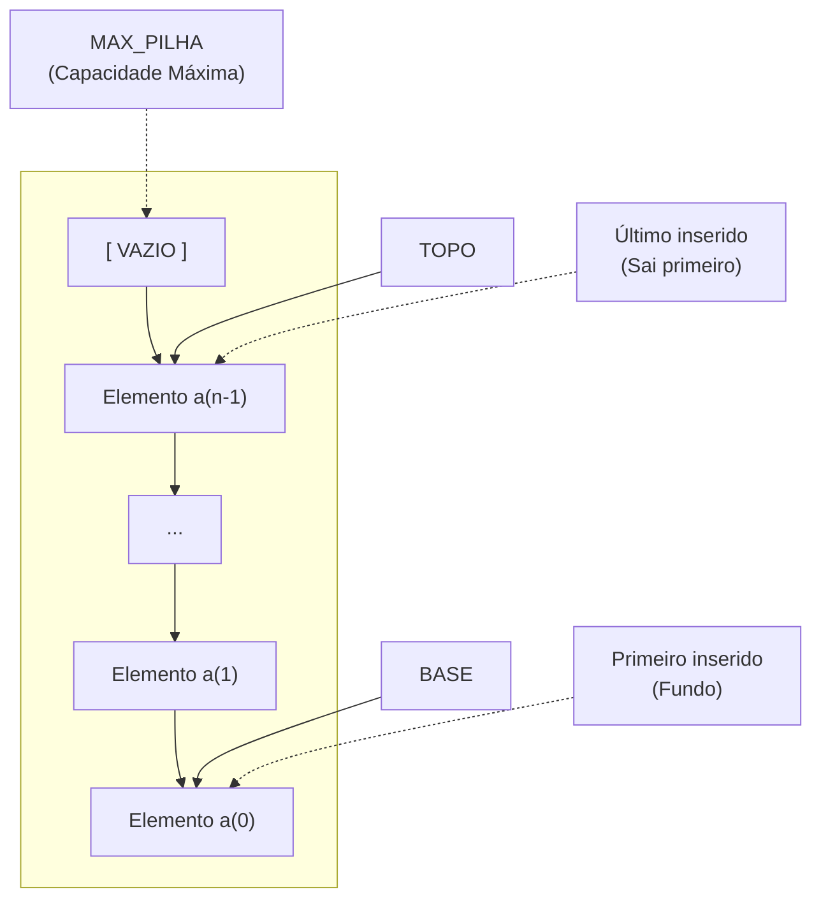

<h1 align="center">05  • Pilha Sequencial</h1>

<p align="center">
  <a href="https://github.com/furlanxzx/Algoritmo-e-Estrutura-de-Dados-1/blob/main/04%20%E2%80%A2%20Array%20e%20Ponteiros/README.md">
    
  </a>
  &nbsp;&nbsp;&nbsp;&nbsp;
  <a href="../README.md">
    
  </a>
  &nbsp;&nbsp;&nbsp;&nbsp;
  <a href="https://github.com/furlanxzx/Algoritmo-e-Estrutura-de-Dados-1/blob/main/06%20%E2%80%A2%20Pilha%20Din%C3%A2mica/README.md">
    
  </a>
</p>

---

## <mark>1 - O Conceito Fundamental</mark>

Imagine uma pilha de pratos ou de livros:
* Você **sempre adiciona** um novo item no **topo**.
* Você **sempre retira** o item que está no **topo**.

Essa regra de funcionamento é chamada de **LIFO** (*Last In, First Out*).

> 💡 **A Regra do LIFO:**
> O **último** elemento a entrar na pilha será obrigatoriamente o **primeiro** elemento a sair.

---

## <mark> 2 - Propriedades e Regras de Acesso</mark>

| Propriedade | Funcionamento |
| :--- | :--- |
| **Inserção (Push)** | O novo elemento entra sempre na posição do **Topo** (ordem de chegada). |
| **Remoção (Pop)** | É removido o elemento mais recente (o que está no topo e chegou por último). |
| **Consulta (Peek)** | Retorna o valor do elemento do **Topo** sem alterar a estrutura. |
| **Base** | Primeiro elemento inserido (`índice 0`). Fica fixo no fundo da pilha. |
| **Topo** | Posição do elemento mais recente. Move-se a cada inserção/remoção. |

---

## <mark> 3 - Representação Gráfica na Memória</mark>


---

## <mark> 4 - Aplicações no Mundo Real e na Computação</mark>

* **Validação de Sintaxe:** Verificação de parênteses `()`, colchetes `[]` e chaves `{}` em códigos fonte.
* **Parsers Aritméticos:** Avaliação e conversão de expressões matemáticas.
* **Gerenciamento de Funções:** Controle do fluxo de execução de funções no sistema.
* **Recursividade:** Armazenamento das chamadas e retornos de funções recursivas.
* **Comando Desfazer (Ctrl + Z):** Historico de ações empilhadas para reversão em ordem inversa.

---

## <mark> 5 - Operações Básicas</mark>

1. **Criar / Inicializar:** Prepara a estrutura na memória e ajusta os ponteiros/índices.
2. **Empilhar (`Push`):** Adiciona um elemento no topo (exige verificar se a pilha não está cheia -> *Overflow*).
3. **Desempilhar (`Pop`):** Remove o elemento do topo (exige verificar se a pilha não está vazia -> *Underflow*).
4. **Consultar (`Peek`):** Retorna o valor do topo sem remover o elemento.
5. **Listar:** Exibe os elementos organizados do topo até a base.

---

## <mark> 6 - Formas de Implementação</mark>

Existem duas formas principais de construir uma pilha em linguagem C:

* **1. Contiguidade Física (Estática):** Alocação usando vetores (*arrays*) de tamanho fixo (`MAX_PILHA`).
* **2. Encadeamento (Dinâmica):** Alocação dinâmica de memória usando ponteiros e `malloc`.

---

## <mark> 7 - Estrutura e Inicialização em C (Estática)</mark>

Definição da `struct` e função para criar a pilha na memória:

```c
#include <stdio.h>
#include <stdlib.h>

#define MAX_PILHA 6 // Capacidade máxima do vetor

// Definição do Tipo TPilha
typedef struct {
    int vet[MAX_PILHA]; // Vetor de elementos
    int topo;           // Índice do elemento no topo
} TPilha;

// Função para Criar e Inicializar a Pilha
TPilha* nova() {
    TPilha* np = (TPilha*) malloc(sizeof(TPilha)); // Aloca memória
    np->topo = -1;                                  // -1 indica PILHA VAZIA
    return np;                                      // Retorna o ponteiro da pilha
}
```

> ⚠️ **Por que `topo = -1`?**
> Em C, vetores começam na posição `0`. Se definíssemos `topo = 0`, significaria que a posição 0 já possui um elemento. O valor `-1` indica formalmente que a pilha está **completamente vazia**.

---

## <mark> 8 - Empilhando dados na pilha (Push) </mark>

Para empilhar um elemento, é **necessário verificar a possibilidade de estouro de pilha** (*Stack Overflow*), uma vez que estamos trabalhando com um vetor de tamanho fixo.

Se o topo atingir o limite máximo (`MAX_PILHA - 1`), a inserção deve ser bloqueada.

```c
int push (TPilha* p, int val){
    // Verifica se a pilha está cheia (Estouro)
    if (p->topo >= MAX_PILHA-1) // Pilha cheia
        return -1;
    
    // Incrementa o topo e adiciona o valor
    (p->topo)++;
    p->vet[p->topo] = val;
    
    return 0; // Sucesso
}
```

---

## <mark> 9 - Desempilhando dados na Pilha (Pop) </mark>

Para desempilhar, é necessário **considerar a possibilidade de *underflow*** (tentar remover de uma pilha que já está vazia).

Se o topo for menor que `0`, significa que não há elementos para remover.

```c
int pop (TPilha* p, int* val){
    // Verifica se a pilha está vazia (Underflow)
    if (p->topo < 0) // Pilha vazia
        return -1;
    
    // Retorna o valor do topo por referência e decrementa o índice
    *val = p->vet[p->topo];
    p->topo--;
    
    return 0; // Sucesso
}
```

---

## <mark> 10 - Liberando espaços alocados </mark>

Para liberar os espaços alocados na memória, basta utilizar a função `free` na estrutura criada. Faça a função `libera` (ou `remover`).

```c
TPilha *remover (TPilha* p){
    free (p);
    return (NULL);
}
```

---

## 📝 Exercícios Práticos

---

### 🟢 Exercício 1 — Listar Elementos da Pilha
> **Enunciado:** 
> Faça uma função para listar todos os elementos da pilha.

<details>
<summary><b>💡 Clique aqui para ver a solução</b></summary>

<br>

#### **Lógica da Solução:**
Para listar os elementos do topo até a base sem destruir a estrutura da pilha, fazemos um laço `for` partindo do índice `p->topo` e decrementando até o índice `0` (base). Não utilizamos a função `pop` para não remover os dados permanentemente.

```c
#include <stdio.h>

// Função para exibir os elementos do topo até a base
void listar(TPilha* p) {
    if (p->topo < 0) {
        printf("A Pilha esta Vazia!\n");
        return;
    }

    printf("Conteudo da Pilha (Topo -> Base)");
    for (int i = p->topo; i >= 0; i--) {
        printf("| %4d |\n", p->vet[i]);
    }
}
```
</details>

---

### 🟡 Exercício 2 — Inversão Total de Frase

> **Enunciado:** 
> Faça um programa que use uma pilha para inverter a ordem das letras da frase. Por exemplo, dado o texto "ESTE EXERCICIO E MUITO FACIL" a saida deve ser "LICAF OTIUM E OICICREXE ETSE". Use as funções `push` e `pop`.

<details>
<summary><b>💡 Clique aqui para ver a solução</b></summary>

<br>

#### **Lógica da Solução:**
Como a pilha possui a propriedade **LIFO** (*Last In, First Out*), se empilharmos todos os caracteres da frase do primeiro ao último e depois desempilharmos todos até esvaziar, a frase sairá **completamente invertida**.

```c
#include <stdio.h>
#include <string.h>

#define MAX 100

typedef struct {
    char vet[MAX];
    int topo;
} TPilha;

void inicializaPilha (TPilha *p)
{
    p->topo = -1;
}

int pilhaVazia (TPilha p)
{
    return (p.topo == -1);
}

int pilhaCheia (TPilha p)
{
    return (p.topo == MAX - 1);
}

void push (TPilha *p, char x)
{
    if (!pilhaCheia(*p)) {
        p->topo++;
        p->vet[p->topo] = x;
    }
}

char pop (TPilha *p)
{
    char x = '\0';
    if (!pilhaVazia(*p)) {
        x = p->vet[p->topo];
        p->topo--;
    }
    return x;
}

int main ()
{
    char texto[MAX];
    TPilha pilha;
    inicializaPilha(&pilha);

    printf("Digite a frase: ");
    fgets(texto, MAX, stdin);
    texto[strcspn(texto, "\n")] = '\0'; // remove o \n deixado pelo fgets

    // empilha a frase inteira, caractere por caractere (inclusive espaços)
    for (int i = 0; texto[i] != '\0'; i++)
        push(&pilha, texto[i]);

    // desempilhar já devolve tudo invertido, palavras e letras
    while (!pilhaVazia(pilha))
        printf("%c", pop(&pilha));

    printf("\n");
    return 0;
}
```
</details>

---

### 🟡 Exercício 3 — Inversão de Letras Conservando as Palavras
> **Enunciado:** 
> Refaça o programa anterior de forma que agora seja invertido a ordem das letras de cada palavra de uma cadeia de caracteres, preservando a ordem das palavras. Por exemplo, dado o texto "ESTE EXERCICIO E MUITO FACIL" a saída deve ser "ETSE OICICREXE E OTIUM LICAF". Use as funções `push` e `pop`.

<details>
<summary><b>💡 Clique aqui para ver a solução</b></summary>

<br>


```c
void inverteCadaPalavra (char *texto, TPilha *pilha)
{
    int i = 0;

    while (texto[i] != '\0') {
        if (texto[i] != ' ') {
            push(pilha, texto[i]);
            i++;
        }
        else {
            // achou um espaço: desempilha só a palavra atual (sai invertida)
            while (!pilhaVazia(*pilha))
                printf("%c", pop(pilha));

            printf(" "); // preserva o espaço original entre as palavras
            i++;
        }
    }

    // imprime a última palavra, que não é seguida de espaço
    while (!pilhaVazia(*pilha))
        printf("%c", pop(pilha));
}

int main ()
{
    char texto[MAX];
    TPilha pilha;
    inicializaPilha(&pilha);

    printf("Digite a frase: ");
    fgets(texto, MAX, stdin);
    texto[strcspn(texto, "\n")] = '\0';

    inverteCadaPalavra(texto, &pilha);

    printf("\n");
    return 0;
}
```
</details>

---

### 🔴 Exercício 4 — Reconhecedor da Linguagem WcM 
> **Enunciado:**
> Digamos que nosso alfabeto seja formado pelas letras `a`, `b` e `c`. Considere o seguinte conjunto de cadeias de caracteres sobre nosso alfabeto: `c`, `aca`, `bcb`, `abcba`, `bacab`, `aacaa`, `bbcbb`, . . . Qualquer cadeia deste conjunto tem a forma **WcM**, sendo que **W** é uma sequência de letras que só contém `a` e `b` e **M** é o inverso de W, ou seja, M é W lido de trás para frente. Escreva um programa que determina se uma cadeia `X` pertence ou não ao nosso conjunto, ou seja, determina se `X` é da forma WcM.

<details>
<summary><b>💡 Clique aqui para ver a solução</b></summary>

<br>

#### **Lógica da Solução:**
1. **Leitura até o caractere `'c'`**: Empilha todos os caracteres `'a'` e `'b'` (Parte W).
2. **Ao encontrar `'c'`**: Para de empilhar e passa para o modo de comparação (Divisor).
3. **Leitura após o `'c'`**: Para cada caractere subsequente (Parte M), desempilha um item e compara. Se forem diferentes ou se a pilha esvaziar antes do final da string, a cadeia é inválida.
4. **Validação Final**: Ao chegar no final da string `'\0'`, a pilha **deve estar completamente vazia**.

```c
#include <stdio.h>
#include <stdbool.h>

#define MAX 100

typedef struct {
    char vet[MAX];
    int topo;
} TPilhaChar;

void push_char(TPilhaChar* p, char c) {
    if (p->topo < MAX - 1) {
        p->vet[++(p->topo)] = c;
    }
}

char pop_char(TPilhaChar* p) {
    if (p->topo >= 0) {
        return p->vet[(p->topo)--];
    }
    return '\0';
}

bool validar_WcM(char* str) {
    TPilhaChar p;
    p.topo = -1;
    int i = 0;

    // 1. Empilha a parte W até encontrar o 'c'
    while (str[i] != '\0' && str[i] != 'c') {
        if (str[i] != 'a' && str[i] != 'b') {
            return false; // Caractere inválido na parte W
        }
        push_char(&p, str[i]);
        i++;
    }

    // Se a string terminou sem encontrar o divisor 'c'
    if (str[i] != 'c') {
        return false;
    }

    i++; // Pula o marcador central 'c'

    // 2. Compara a parte M com o topo da pilha (inverso de W)
    while (str[i] != '\0') {
        if (p.topo < 0) {
            return false; // Sobrou caractere, mas a pilha esvaziou
        }
        char topo_val = pop_char(&p);
        if (str[i] != topo_val) {
            return false; // Caractere não corresponde ao inverso
        }
        i++;
    }

    // 3. A cadeia só é válida se a pilha ficou totalmente vazia
    return (p.topo == -1);
}

int main() {
    char* testes[] = {"c", "aca", "bcb", "abcba", "bacab", "aacaa", "acb", "abcca", "ab"};
    int n = sizeof(testes) / sizeof(testes[0]);

    printf("Validacao da Linguagem WcM");
    for (int k = 0; k < n; k++) {
        if (validar_WcM(testes[k])) {
            printf("Cadeia \"%s\": VALIDA [V]\n", testes[k]);
        } else {
            printf("Cadeia \"%s\": INVALIDA [X]\n", testes[k]);
        }
    }

    return 0;
}
```
</details>

---

<p align="center">
  <a href="https://github.com/furlanxzx/Algoritmo-e-Estrutura-de-Dados-1/blob/main/04%20%E2%80%A2%20Array%20e%20Ponteiros/README.md">
    
  </a>
  &nbsp;&nbsp;&nbsp;&nbsp;
  <a href="../README.md">
    
  </a>
  &nbsp;&nbsp;&nbsp;&nbsp;
  <a href="https://github.com/furlanxzx/Algoritmo-e-Estrutura-de-Dados-1/blob/main/06%20%E2%80%A2%20Pilha%20Din%C3%A2mica/README.md">
    
  </a>
</p>
