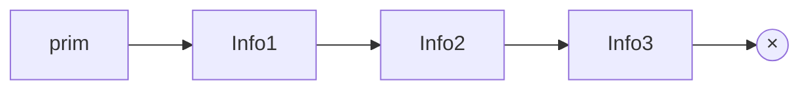

<h1 align="center">Pilha Dinâmica</h1>

<p align="center">
  <a href="https://github.com/furlanxzx/Algoritmo-e-Estrutura-de-Dados-1/blob/main/05%20%E2%80%A2%20Pilha%20Sequencial/README.md">
    
  </a>
  &nbsp;&nbsp;&nbsp;&nbsp;
  <a href="../README.md">
    
  </a>
  &nbsp;&nbsp;&nbsp;&nbsp;
  <a href="https://github.com/furlanxzx/Algoritmo-e-Estrutura-de-Dados-1/blob/main/07%20%E2%80%A2%20Fila%20Din%C3%A2mica/README.md">
    
  </a>
</p>

---

## <mark> 1 - Introdução às Pilhas de Alocação Dinâmica </mark>

Uma pilha dinâmica é formada por uma sequência de estruturas (comumente chamadas de **nós da pilha**) que são interligadas entre si através de ponteiros. Diferente do modelo estático (vetores), esta estrutura é criada dinamicamente na memória, utilizando funções como `malloc()` e `free()`. Isso torna o processo de incluir ou retirar nós muito mais simples e eficiente.

### <mark> 1.1 - Como funciona na Memória?
* **Alocação sob demanda:** Numa pilha com nós encadeados, para cada novo elemento inserido, alocamos um espaço de memória específico para armazená-lo.
* **Tamanho flexível:** O espaço total de memória gasto pela estrutura é proporcional ao número de elementos armazenados nela no momento.
* ⚠️ **Atenção:** Não podemos garantir que os elementos armazenados ocuparão um espaço de memória sequencial. Portanto, **não temos acesso direto** aos elementos da pilha como tínhamos nos índices de um vetor.

> O ponteiro da última estrutura da pilha aponta para `NULL`, indicando que chegou ao final da pilha.


- **P**: elemento que aponta para o topo da pilha
- **x**: valor armazenado no nó
- **N**: `NULL`

### <mark> 1.2 - Entendendo o Encadeamento
* Para que seja possível percorrer todos os elementos da pilha, devemos explicitamente guardar o encadeamento dos elementos.
* Cada nó contém a informação e um ponteiro para a estrutura que é a sua sucessora na pilha.
* Toda a sequência é acessada por um único ponteiro que aponta para o primeiro nó (o topo da pilha).
* O ponteiro da última estrutura da pilha aponta para `NULL`, sinalizando que não existe um próximo elemento e a pilha chegou ao fim.



---

## <mark> 1.3 - Declaração em Linguagem C

Para representar isso no código, criamos uma estrutura (`struct`) contendo o campo de informação (`info`) e o ponteiro para o próximo nó (`prox`).

```c
// Declaração do Nó da Pilha
typedef struct pilha {
    int info;               // Dado armazenado
    struct pilha* prox;     // Ponteiro para o próximo nó
} TPilha;

// Definição de um tipo ponteiro para facilitar a leitura
typedef TPilha *PPilha;
```

---

## <mark> 1.4 - Inicialização e Manipulação </mark>

Antes de utilizarmos a pilha, ela precisa ser inicializada. Como ela começa vazia, o topo não aponta para lugar nenhum.

```c
// Inicializa a pilha retornando NULL
PPilha inicializa_pilha() {
    return NULL;
}
```

**Regras para Manipulação (Inserção):**
* Para cada novo elemento, deve-se alocar dinamicamente a memória necessária e encadeá-lo na pilha existente.
* Na pilha encadeada, é mais fácil inserir os elementos sempre no **início** do encadeamento.
* O ponteiro principal que representa a pilha deve ter seu valor atualizado constantemente, pois a pilha deve passar a ser representada pelo ponteiro para o **novo primeiro elemento**.

---
## <mark> 1.5 - Manipulação de Pilha Encadeada </mark>

Para manipularmos adequadamente uma pilha encadeada (dinâmica), precisamos implementar quatro funções fundamentais:
* Inserção de um novo elemento (Push).
* Remoção de um nó na pilha (Pop).
* Impressão de toda a pilha.
* Liberação dos espaços alocados para a pilha.

---

## <mark> 2 - Inserindo na Pilha Encadeada (Função `push`) </mark>

A função de inserção recebe o ponteiro do topo atual da pilha e o valor (neste caso, um número inteiro) a ser armazenado. O processo completo ocorre em quatro passos simples:
1. Alocamos um espaço de memória dinamicamente para o **novo** nó.
2. Atribuímos o valor recebido ao campo de informação (`info`) desse novo nó.
3. O encadeamento é feito apontando o campo `prox` do novo nó para o que era o topo atual da `pilha`.
4. Retornamos o ponteiro do `novo` nó, atualizando a referência principal da pilha no programa.

**Código:**

```c
PPilha push(PPilha pilha, int i)
{
    PPilha novo = (PPilha) malloc(sizeof(TPilha));
    novo->info = i;
    novo->prox = pilha;
    return novo;
}
```

> **Exemplo Prático (Teste de Mesa):**
> Ao utilizar a função acima para armazenar sequencialmente o conjunto de dados `{9, 10, 19, 15}`, a estrutura resultante na memória terá o número `15` no topo. O encadeamento seguirá a ordem: `15 -> 19 -> 10 -> 9 -> NULL` (aterramento).

---
## <mark> 3 - Retirando da Pilha Encadeada (Função `pop`) </mark>

A função de remoção (`pop`) tem o objetivo de retirar o elemento que está no topo da pilha, retornando o seu valor e liberando o espaço de memória que ele ocupava.

**Código:**

```c
PPilha pop (PPilha pilha, int *v){
    // Ponteiro auxiliar para guardar o endereço do elemento a ser retirado
    PPilha p = pilha; 
    
    // Se a pilha estiver vazia, não há o que retirar
    if (pilha == NULL) return (pilha);
    
    // Salva o valor do nó removido na variável passada por referência
    *v = p->info;
    
    // Retira o elemento do início: atualiza o topo da pilha para o próximo nó
    pilha = p->prox;
    
    // Libera a memória do nó retirado
    free(p);
    
    // Retorna o novo topo da pilha
    return pilha;
}
```

---

## 📝 Exercícios Práticos

> Recomendação: Tentar resolver os exercícios antes de consultar as respostas me ajudou a melhorar o compreendimento da matéria. 

---

### 🟢 Exercício 1 

> **Enunciado:**
> Faça a função que imprima toda a pilha e a função que libera os espaços alocados (de forma iterativa).

<details>
<summary><b>💡 Clique aqui para ver a solução</b></summary>

```c
// Função para imprimir os elementos da pilha
void imprime_pilha(PPilha pilha) {
    PPilha aux = pilha;
    printf("Elementos da Pilha:\n");
    while (aux != NULL) {
        printf("%d\n", aux->info);
        aux = aux->prox;
    }
}

// Função para liberar os espaços alocados para a pilha
PPilha libera_pilha(PPilha pilha) {
    PPilha aux = pilha;
    while (aux != NULL) {
        PPilha temp = aux->prox; // Guarda o próximo nó
        free(aux);               // Libera o nó atual
        aux = temp;              // Avança para o próximo
    }
    return NULL; // Retorna NULL para atualizar o ponteiro principal da pilha
}
```
</details>

---

### 🟡 Exercício 2

> **Enunciado:**
> Faça uma função **recursiva** que libera a pilha e outra que imprime.

<details>
<summary><b>💡 Clique aqui para ver a solução</b></summary>

```c
// Função recursiva para imprimir a pilha
void imprime_pilha_rec(PPilha pilha) {
    if (pilha != NULL) {
        printf("%d\n", pilha->info);
        imprime_pilha_rec(pilha->prox); // Chamada recursiva para o próximo
    }
}

// Função recursiva para liberar a pilha
PPilha libera_pilha_rec(PPilha pilha) {
    if (pilha != NULL) {
        libera_pilha_rec(pilha->prox); // Vai até o final da pilha primeiro
        free(pilha);                   // Libera na volta da recursão
    }
    return NULL;
}
```
</details>

---

### 🔴 Exercício 3

> **Enunciado:**
> Utilizando as funções de manipulação de pilha vistas em aula (`push` e `pop`), escreva uma função que remova um item com valor `v` da pilha. Se não encontrar o elemento `v`, retorne a pilha sem modificação.

*(Dica: Lembre-se que em uma pilha nós só temos acesso ao topo. Para tirar alguém do meio, você precisará de uma estrutura auxiliar para guardar os elementos que estão acima dele).*

<details>
<summary><b>💡 Clique aqui para ver a solução</b></summary>

```c
PPilha remove_item(PPilha pilha, int v) {
    PPilha temp = inicializa_pilha(); // Pilha auxiliar
    int aux;
    int encontrou = 0;

    // 1. Desempilha da original e procura o valor
    while (pilha != NULL) {
        pilha = pop(pilha, &aux);
        if (aux == v) {
            encontrou = 1; // Achou o item, sai do laço sem empilhar na auxiliar
            break; 
        }
        temp = push(temp, aux); // Guarda na auxiliar
    }

    // 2. Devolve os elementos da pilha auxiliar para a original
    // Isso garante que a ordem original seja restaurada
    while (temp != NULL) {
        temp = pop(temp, &aux);
        pilha = push(pilha, aux);
    }

    if (!encontrou) {
        printf("Elemento %d nao encontrado na pilha.\n", v);
    }

    return pilha;
}
```
</details>

---

<p align="center">
  <a href="https://github.com/furlanxzx/Algoritmo-e-Estrutura-de-Dados-1/blob/main/05%20%E2%80%A2%20Pilha%20Sequencial/README.md">
    
  </a>
  &nbsp;&nbsp;&nbsp;&nbsp;
  <a href="../README.md">
    
  </a>
  &nbsp;&nbsp;&nbsp;&nbsp;
  <a href="https://github.com/furlanxzx/Algoritmo-e-Estrutura-de-Dados-1/blob/main/07%20%E2%80%A2%20Fila%20Din%C3%A2mica/README.md">
    
  </a>
</p>
