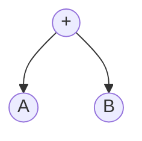
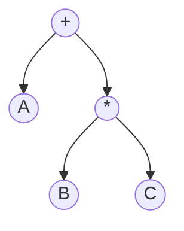
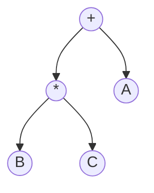
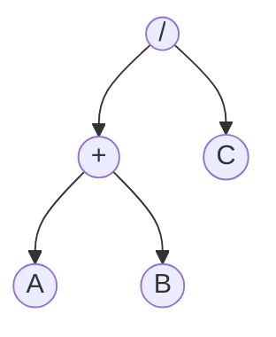
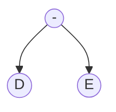
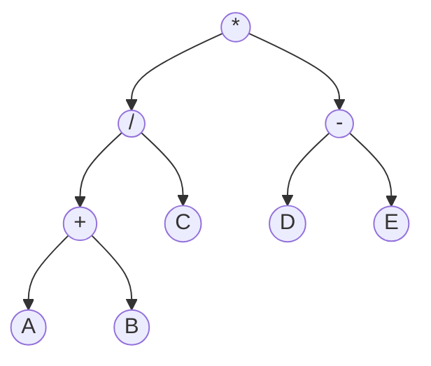
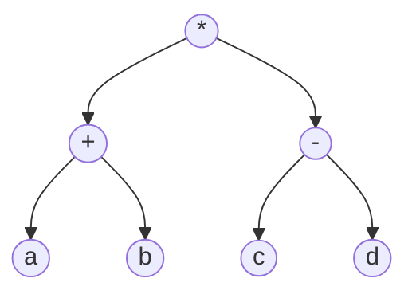
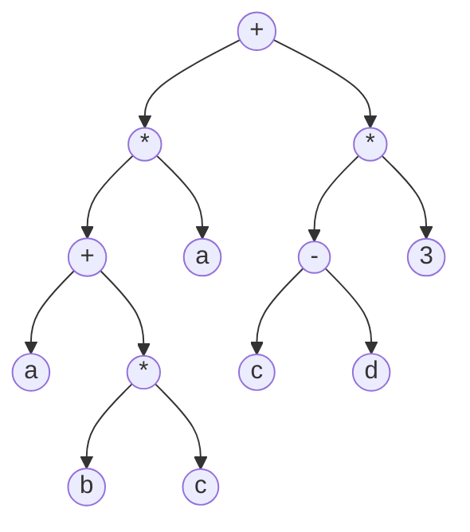
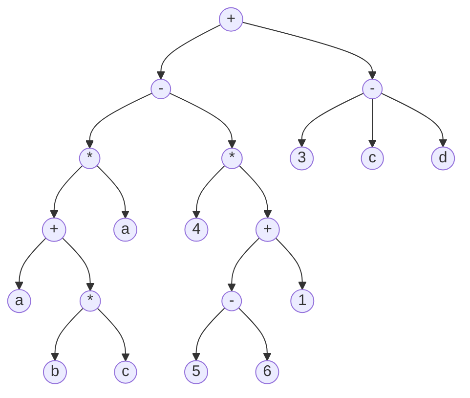
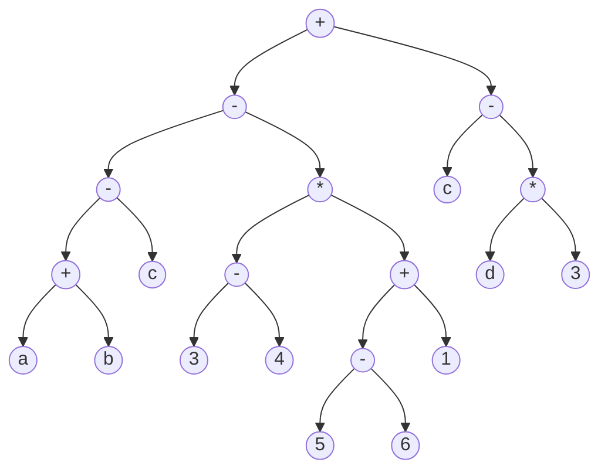

<h1 align="center">Árvore de Expressão</h1>

<p align="center">
  <a href="https://github.com/furlanxzx/Algoritmo-e-Estrutura-de-Dados-1/blob/main/16%20%E2%80%A2%20Percurso%20em%20%C3%81rvores%20Bin%C3%A1rias/README.md">
    
  </a>
  &nbsp;&nbsp;&nbsp;&nbsp;
  <a href="../README.md">
    
  </a>
  &nbsp;&nbsp;&nbsp;&nbsp;
  <a href="https://github.com/furlanxzx/Algoritmo-e-Estrutura-de-Dados-1/blob/main/18%20%E2%80%A2%20%C3%81rvores%20Gen%C3%A9ricas/README.md">
    
  </a>
</p>

---

## <mark> 1 - O que é uma Árvore de Expressão </mark>

> Uma expressão aritmética pode ser armazenada sob a forma de uma **árvore binária**, em que as raízes armazenam as operações a serem efetuadas, e as sub-árvores à esquerda e à direita armazenam os operandos a serem usados.

Por exemplo, a expressão `a + b` é representada assim:



O operador vira a **raiz**, e cada operando vira um **filho** — bem direto ao ponto, quando a expressão só tem uma operação.

---

## <mark> 2 - Prioridade dos Operadores </mark>

As coisas ficam mais interessantes quando a expressão tem **mais de um operador**. No caso de `A + B * C`, a **prioridade dos operadores** e a **ordem de ocorrência** precisam ser respeitadas ao montar a árvore:



Como `*` tem prioridade maior que `+`, ele "fica mais fundo" na árvore — é resolvido primeiro. Percorrendo essa árvore em **pré-ordem** (Raiz, Esquerda, Direita) e em **pós-ordem** (Esquerda, Direita, Raiz), obtemos as formas prefixa e posfixa da expressão, respectivamente:

- **Prefixa:** `+ A * B C`
- **Posfixa:** `A B C * +`

> 📌 Isso não é coincidência — é justamente **para isso** que a árvore de expressão serve. Ela é o passo intermediário que um compilador usa para converter uma expressão comum (infixa, como a gente escreve) em prefixa ou posfixa (formas muito mais fáceis de avaliar por uma máquina, sem precisar se preocupar com parênteses ou prioridade de operadores).

### A ordem importa

A expressão `A + B * C` é **diferente** de `B * C + A`, mesmo os dois resultando (matematicamente) na mesma coisa — a **árvore** de cada uma é diferente, porque a operação que fica na raiz é sempre a **última a ser aplicada**:



Repare que, embora os dois casos tenham exatamente as mesmas três letras e os mesmos dois operadores, a **posição de `A`** muda completamente — na primeira árvore ele é filho esquerdo da raiz `+`, aqui ele é filho **direito**. Isso reflete que, na expressão original, `A` aparece **antes** de `B*C` no primeiro caso, e **depois** no segundo.

---

## <mark> 3 - Montando a Árvore de uma Expressão Complexa: Passo a Passo </mark>

Como fica a representação da expressão `((A+B)/C)*(D-E)` usando árvore binária?

> 💡 **Dica:** resolva sempre **do centro para fora** — comece pelas operações mais "internas" (dentro dos parênteses mais aninhados) e vá subindo.

**Passo 1 — resolva `A + B`:**


**Passo 2 — agora resolva `(A+B) / C`:** a árvore do passo 1 inteira vira a sub-árvore **esquerda** da nova raiz `/`, e `C` vira a sub-árvore direita.



**Passo 3 — em paralelo, resolva `D - E`:**



**Passo 4 — finalmente, junte tudo com `*`:** a árvore do passo 2 vira a sub-árvore esquerda, e a árvore do passo 3 vira a sub-árvore direita.



E essa é a árvore final de `((A+B)/C)*(D-E)`. Note como cada par de parênteses da expressão original virou um "nível" a mais de profundidade na árvore.

---

## <mark> 4 - Verificando a Árvore: a Ordem Infixa </mark>

Uma propriedade muito útil: se você percorrer **qualquer** árvore de expressão em **ordem infixa** (Esquerda, Raiz, Direita), os **operandos sempre aparecem na mesma ordem** em que estavam na expressão original — isso vale sempre, independente de como a árvore foi construída.

> 📌 Isso é uma ótima forma de **conferir** se a árvore que você montou está certa: se ao percorrer em ordem infixa você não recupera a expressão original (com os operandos na mesma ordem), alguma coisa foi montada errada.

---

## 📝 Exercícios Práticos

> Transforme as seguintes expressões para posfixa, utilizando árvores binárias para fazer a transformação. A árvore gerada deve resultar exatamente a mesma expressão quando percorrida na ordem infixa (inclusive com os operandos na mesma ordem).

### 🟢 Exercício 1 — `(a+b) * (c-d)` 

<details>
<summary>💡 Clique aqui para ver a solução</summary>

Mesma lógica do exemplo `((A+B)/C)*(D-E)` visto acima, só que mais curta: cada parte entre parênteses vira uma sub-árvore, e o `*` (fora dos parênteses) vira a raiz.



**Forma posfixa (pós-ordem):** `a b + c d - *`

</details>

---

### 🟡 Exercício 2 — `(a+b*c)*a + (c-d)*3` 

<details>
<summary>💡 Clique aqui para ver a solução</summary>

O `+` mais externo é a **última** operação aplicada (é ele que "junta" os dois grandes pedaços da expressão), então ele vira a raiz. Cada lado dele é resolvido separadamente, de dentro para fora — o lado esquerdo tem mais um nível de aninhamento por causa do `b*c` dentro do primeiro parêntese.



**Forma posfixa (pós-ordem):** `a b c * + a * c d - 3 * +`

</details>

---

### 🔴 Exercício 3 — `(a+b*c)*a – 4*(5-6+1) + (c-d)*3` 

<details>
<summary>💡 Clique aqui para ver a solução</summary>

Aqui entra um detalhe importante: `+` e `-` têm a **mesma prioridade**, então são resolvidos **da esquerda para a direita** (associatividade à esquerda). Ou seja, a expressão é lida como:

```
[ (a+b*c)*a  –  4*(5-6+1) ]  +  [ (c-d)*3 ]
```

Isso significa que a operação `-` fica **mais funda** na árvore (é resolvida primeiro), e o `+` final (o último a ser aplicado) é que fica na raiz. O mesmo raciocínio de associatividade à esquerda se aplica dentro de `5-6+1`, que vira `(5-6)+1`.



>  Repare que o nó `n17` (o `-` de `c-d`) tem uma peculiaridade no desenho acima: ele é pai de `c` e `d`, e ao mesmo tempo é filho direito da raiz junto com o `*` de `(c-d)*3` — se estiver com dificuldade de visualizar, revise o Exercício 1, que tem exatamente essa mesma sub-árvore `(c-d)*3`.

**Forma posfixa (pós-ordem):** `a b c * + a * 4 5 6 - 1 + * - c d - 3 * +`

</details>

---

### 🔴 Exercício 4 — `(a+b-c) – (3-4)*(5-6+1) + (c-d*3)` 

<details>
<summary>💡 Clique aqui para ver a solução</summary>

De novo, `+` e `-` no nível mais externo são resolvidos da esquerda para a direita:

```
[ (a+b-c)  –  (3-4)*(5-6+1) ]  +  [ (c-d*3) ]
```

Alguns detalhes que merecem atenção:

- `(a+b-c)` também é resolvido da esquerda para a direita: primeiro `a+b`, depois `-c`.
- `(c-d*3)`: aqui `*` tem prioridade sobre `-`, então é `c - (d*3)`, e **não** `(c-d)*3` — repare como isso é bem diferente do Exercício 1!



**Forma posfixa (pós-ordem):** `a b + c - 3 4 - 5 6 - 1 + * - c d 3 * - +`

</details>

---

<p align="center">
  <a href="https://github.com/furlanxzx/Algoritmo-e-Estrutura-de-Dados-1/blob/main/16%20%E2%80%A2%20Percurso%20em%20%C3%81rvores%20Bin%C3%A1rias/README.md">
    
  </a>
  &nbsp;&nbsp;&nbsp;&nbsp;
  <a href="../README.md">
    
  </a>
  &nbsp;&nbsp;&nbsp;&nbsp;
  <a href="https://github.com/furlanxzx/Algoritmo-e-Estrutura-de-Dados-1/blob/main/18%20%E2%80%A2%20%C3%81rvores%20Gen%C3%A9ricas/README.md">
    
  </a>
</p>
