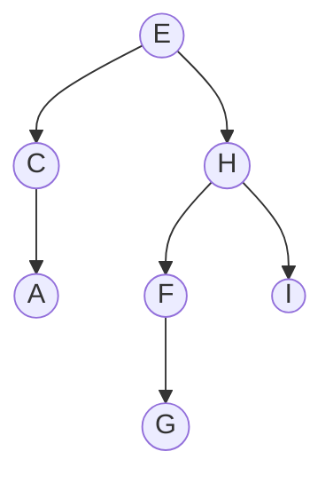
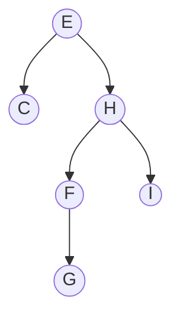
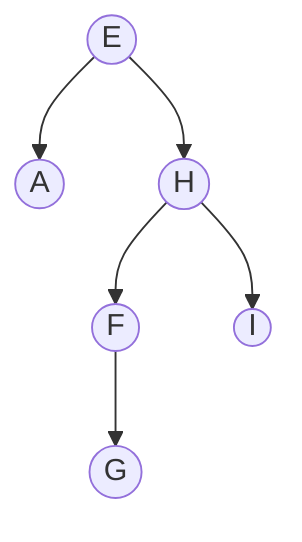
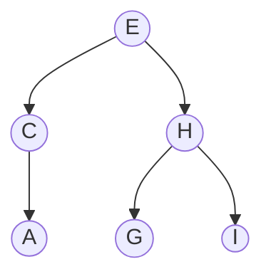
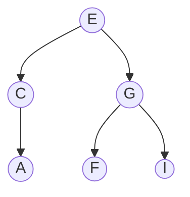
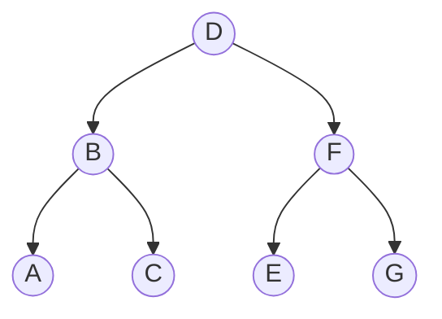
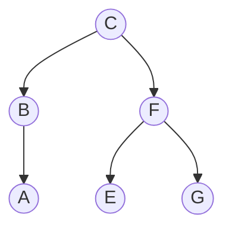
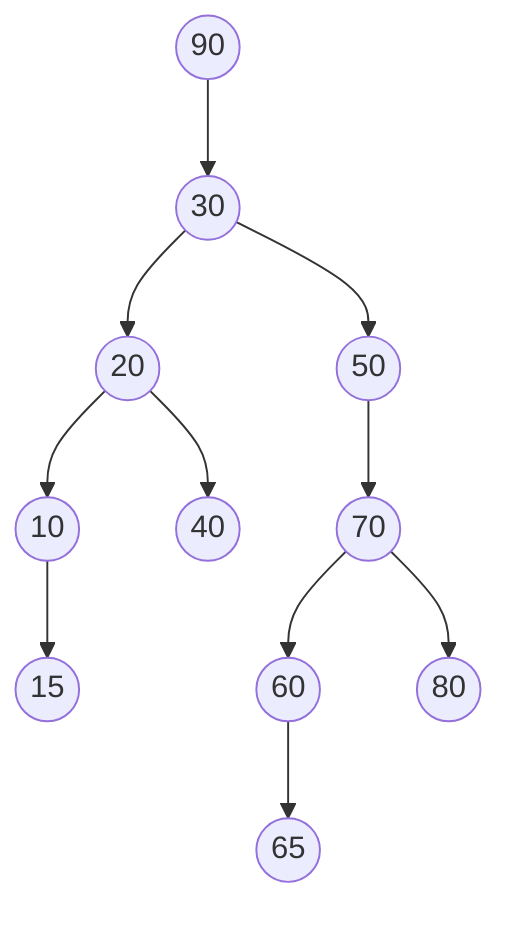
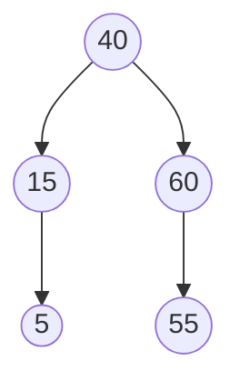

<h1 align="center">ABB - Remoção</h1>

<p align="center">
  <a href="https://github.com/furlanxzx/Algoritmo-e-Estrutura-de-Dados-1/blob/main/19%20%E2%80%A2%20ABB%20-%20Inser%C3%A7%C3%A3o/README.md">
    
  </a>
  &nbsp;&nbsp;&nbsp;&nbsp;
  <a href="../README.md">
    
  </a>
  &nbsp;&nbsp;&nbsp;&nbsp;
  <a href="https://github.com/furlanxzx/Algoritmo-e-Estrutura-de-Dados-1/blob/main/01%20%E2%80%A2%20Defini%C3%A7%C3%B5es%20Iniciais%20e%20Nota%C3%A7%C3%A3o%20Assint%C3%B3tica/README.md">
    
  </a>
</p>

---

## <mark> 1 - Definição </mark>

Remover um nó de uma ABB é mais delicado que inserir, porque, ao retirar o nó, é preciso **religar** a árvore de forma que ela continue sendo uma ABB válida.

Existem **quatro** possibilidades para o nó que será retirado:

-  um nó **sem descendentes** (folha);
-  um nó **sem descendente à direita**, mas com descendente à esquerda;
-  um nó **sem descendente à esquerda**, mas com descendente à direita;
-  um nó **com dois filhos**.

No programa, isso pode ser representado por **4 testes de seleção (if)**:

```c
if ((a->esq == NULL) && (a->dir == NULL)) {
    // nó sem descendentes
}
else if ((a->esq != NULL) && (a->dir == NULL)) {
    // somente descendente à esquerda
}
else if ((a->esq == NULL) && (a->dir != NULL)) {
    // somente descendente à direita
}
else {
    // nó com 2 filhos
}
```

---

## <mark> 2 - Casos de Remoção </mark>

Para ilustrar os casos, vamos usar sempre a mesma árvore de referência:



### <mark> 2.1 - Nó sem descendentes (folha) </mark>

No caso da retirada de uma folha (`A`, `G` ou `I`), basta atribuir `NULL` ao ponteiro do pai que aponta para o nó e liberar a memória ocupada por ele.

**Exemplo:** retirando `A`.



### <mark> 2.2 - Nó com um único filho </mark>

Nesse caso, o nó pai simplesmente passa a apontar para o **neto** (o filho do nó removido "sobe" um nível).

**Exemplo:** retirando `C` (que só tem o filho `A`) — `A` sobe e passa a ser filho direto de `E`.



**Exemplo:** a partir da árvore original, retirando `F` (que só tem o filho `G`) — `G` sobe e passa a ser filho direto de `H`.



### </mark> 2.3 - Nó com dois filhos </mark>

Não é possível que os dois filhos assumam o lugar do pai ao mesmo tempo. A solução é:

1. buscar o **maior elemento da sub-árvore esquerda** do nó a ser removido (ou, alternativamente, o **menor elemento da sub-árvore direita**);
2. colocar o valor desse elemento no lugar do nó removido;
3. remover o nó de onde esse elemento foi retirado (que, por definição, cai em um dos casos mais simples acima — folha ou nó com um filho).

**Exemplo:** retirando `H` (tem os filhos `F` e `I`). O maior elemento na sub-árvore esquerda de `H` (a sub-árvore que começa em `F`) é `G`.


`H` é substituído por `G`, e o `G` original (que era folha) é removido:



> ⚠️ **Atenção a um detalhe:** se o maior elemento da sub-árvore esquerda (`G`, no exemplo) tivesse ele próprio um filho à esquerda — digamos, `F2` — esse `F2` não pode "sumir". Como `G` estava pendurado à **direita** de `F`, ao promover `G` para o lugar de `H`, o `F2` deve ser "pendurado" no lugar que `G` deixou, ou seja, à **direita** de `F`.

---

## <mark> 3 - Algoritmo de Remoção </mark>

### 🟡 Exercício — Função Retira 

> Considerando a teoria vista sobre a remoção, tente escrever o algoritmo de remoção.
>
> Lembre-se dos 4 casos: nó folha, nó com filho só à esquerda, nó com filho só à direita, e nó com dois filhos.

<details>
<summary>💡 Clique aqui para ver a solução</summary>

Assim como `insere` e `pesquisa`, a função `retira` desce pela árvore comparando `x` com `a->info` até **encontrar** o nó a remover. Ao encontrar, tratamos os 4 casos vistos acima:

```c
PABB retira (PABB a, int x)
{
    if (a == NULL)
        return NULL; // elemento não encontrado, nada a fazer

    if (x < a->info)
        a->esq = retira(a->esq, x);
    else if (x > a->info)
        a->dir = retira(a->dir, x);
    else {
        // achou o nó a ser removido

        if (a->esq == NULL && a->dir == NULL) {
            // caso 1: nó sem descendentes
            free(a);
            a = NULL;
        }
        else if (a->esq != NULL && a->dir == NULL) {
            // caso 2: só tem filho à esquerda
            PABB aux = a;
            a = a->esq;
            free(aux);
        }
        else if (a->esq == NULL && a->dir != NULL) {
            // caso 3: só tem filho à direita
            PABB aux = a;
            a = a->dir;
            free(aux);
        }
        else {
            // caso 4: tem os dois filhos
            // procura o maior elemento da sub-árvore esquerda
            PABB maior = a->esq;
            while (maior->dir != NULL)
                maior = maior->dir;

            a->info = maior->info;
            a->esq = retira(a->esq, maior->info);
        }
    }

    return a;
}
```

📌 Repare que, no caso 4, a chamada `a->esq = retira(a->esq, maior->info)` remove o nó `maior` da sub-árvore esquerda — e essa remoção sempre vai cair no caso 1 ou no caso 2 (nunca no caso 3 nem de volta no caso 4), pois um elemento "mais à direita possível" não pode ter filho à direita.

</details>

---

## 📝 Exercícios Práticos

### 🟢 Exercício 1

Remova o nó `D` da árvore abaixo:



<details>
<summary>💡 Clique aqui para ver a solução</summary>

`D` tem dois filhos (`B` e `F`), então caímos no caso 4: buscamos o **maior elemento da sub-árvore esquerda** (a sub-árvore que começa em `B`).

Partindo de `B`, andamos sempre para a direita: `B → C`. Como `C` não tem filho à direita, `C` é o maior elemento — e ele é uma folha, então sua remoção é trivial (caso 1).

`D` é substituído por `C`, e o `C` original é removido:



</details>

---

### 🔴 Exercício 2

Dada a árvore de busca binária abaixo, redesenhe-a após cada operação, na seguinte ordem:

```
Inserir 55, Inserir 5, Retirar 20, Retirar 90, Retirar 30,
Retirar 70, Retirar 80, Retirar 50, Retirar 10, Retirar 65.
```



<details>
<summary>💡 Clique aqui para ver a solução</summary>

Seguindo a regra de inserção (`x < raiz` → esquerda, senão → direita) e a de remoção (2 filhos → substitui pelo maior da sub-árvore esquerda), o passo a passo é:

| Operação | O que acontece |
|---|---|
| Inserir 55 | 55 < 90 → 55 ≥ 30 → 55 ≥ 50 → 55 < 70 → 55 < 60 → vira filho esquerdo de 60 |
| Inserir 5 | 5 < 90 → 5 < 30 → 5 < 20 → 5 < 10 → vira filho esquerdo de 10 |
| Retirar 20 | 20 tem 2 filhos (10 e 40) → maior à esquerda é 15 (10 → dir) → 20 vira 15, remove o 15 original |
| Retirar 90 | 90 só tem filho à esquerda (30) → 30 sobe e vira a nova raiz |
| Retirar 30 | 30 (agora raiz) tem 2 filhos → maior à esquerda é 40 (15 → dir) → 30 vira 40, remove o 40 original |
| Retirar 70 | 70 tem 2 filhos (60 e 80) → maior à esquerda é 65 (60 → dir) → 70 vira 65, remove o 65 original |
| Retirar 80 | 80 é folha → remove direto |
| Retirar 50 | 50 só tem filho à direita (65, que ficou no lugar de 70) → esse filho sobe |
| Retirar 10 | 10 só tem filho à esquerda (5) → 5 sobe |
| Retirar 65 | 65 só tem filho à esquerda (60) → 60 sobe |

Árvore final:



</details>

---

### 🟡 Exercício 3

Escreva uma função para verificar se uma árvore binária é ABB.

<details>
<summary>💡 Clique aqui para ver a solução</summary>

A ideia é a mesma usada para validar um caminho de pesquisa (ver exercício de pesquisa prefixa no README de Inserção): cada nó visitado impõe um **limite inferior** e um **limite superior** para os valores da sub-árvore correspondente. Uma árvore é ABB se, para todo nó, seu valor respeita os limites herdados do caminho até ele, e essa propriedade vale recursivamente para as duas sub-árvores.

```c
int ehABBAux (PABB a, int minimo, int maximo)
{
    if (a == NULL)
        return 1;

    if (a->info < minimo || a->info > maximo)
        return 0;

    return ehABBAux(a->esq, minimo, a->info) &&
           ehABBAux(a->dir, a->info, maximo);
}

int ehABB (PABB a)
{
    return ehABBAux(a, INT_MIN, INT_MAX);
}
```

📌 Note que `a->info` é passado como o novo `maximo` para a sub-árvore esquerda e como o novo `minimo` para a sub-árvore direita — é exatamente a mesma lógica de "limites que se acumulam" usada para validar o caminho de uma pesquisa.

</details>

---

### 🟡 Exercício 4

Escreva uma função para excluir todas as folhas de uma ABB.

<details>
<summary>💡 Clique aqui para ver a solução</summary>

Percorremos a árvore verificando, para cada nó, se algum dos filhos é folha. Se for, removemos esse filho; senão, continuamos descendo por ele.

```c
PABB excluiFolhas (PABB a)
{
    if (a == NULL)
        return NULL;

    if (a->esq == NULL && a->dir == NULL) {
        // o próprio 'a' é folha
        free(a);
        return NULL;
    }

    a->esq = excluiFolhas(a->esq);
    a->dir = excluiFolhas(a->dir);

    return a;
}
```

📌 Como o teste de "é folha" usa os ponteiros `esq`/`dir` originais do nó **antes** de recursão nos filhos, cada nó é avaliado com a estrutura que ele tinha no início — ou seja, a função remove exatamente as folhas que existiam na árvore original, em uma única passada.

</details>

---

### 🟢 Exercício 5

Escreva uma função que conte o número de folhas em uma ABB.

<details>
<summary>💡 Clique aqui para ver a solução</summary>

```c
int contaFolhas (PABB a)
{
    if (a == NULL)
        return 0;

    if (a->esq == NULL && a->dir == NULL)
        return 1;

    return contaFolhas(a->esq) + contaFolhas(a->dir);
}
```

</details>

---

### 🔴 Exercício 6

Escreva uma função que remova um nó contendo uma dada chave **e seus descendentes**.

<details>
<summary>💡 Clique aqui para ver a solução</summary>

Diferente da função `retira`, aqui não precisamos religar nada no lugar do nó removido — a sub-árvore inteira, a partir do nó com a chave buscada, deixa de existir. Usamos uma função auxiliar para liberar toda a sub-árvore (pós-ordem: libera os filhos antes do próprio nó).

```c
void liberaSubarvore (PABB a)
{
    if (a == NULL)
        return;

    liberaSubarvore(a->esq);
    liberaSubarvore(a->dir);
    free(a);
}

PABB retiraSubarvore (PABB a, int chave)
{
    if (a == NULL)
        return NULL; // chave não encontrada

    if (chave < a->info)
        a->esq = retiraSubarvore(a->esq, chave);
    else if (chave > a->info)
        a->dir = retiraSubarvore(a->dir, chave);
    else {
        // achou o nó: libera ele e toda a sua descendência
        liberaSubarvore(a);
        return NULL;
    }

    return a;
}
```

</details>

---

<p align="center">
  <a href="https://github.com/furlanxzx/Algoritmo-e-Estrutura-de-Dados-1/blob/main/19%20%E2%80%A2%20ABB%20-%20Inser%C3%A7%C3%A3o/README.md">
    
  </a>
  &nbsp;&nbsp;&nbsp;&nbsp;
  <a href="../README.md">
    
  </a>
  &nbsp;&nbsp;&nbsp;&nbsp;
  <a href="https://github.com/furlanxzx/Algoritmo-e-Estrutura-de-Dados-1/blob/main/01%20%E2%80%A2%20Defini%C3%A7%C3%B5es%20Iniciais%20e%20Nota%C3%A7%C3%A3o%20Assint%C3%B3tica/README.md">
    
  </a>
</p>
