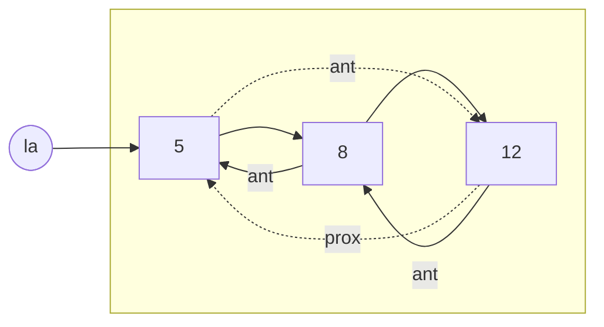

<h1 align="center">Prova Resolvida — P1 Integral (2023) — Profa. Regina Coelho</h1>

---

### Questão 1 🟢 (2,0 pts) — Pilha Encadeada com `push`/`pop`

> **Enunciado:** Considere o programa incompleto a seguir e responda:
>
> ```c
> #include <stdio.h>
> typedef struct TipoItem {
>     int chave;
>     struct TipoItem *prox;
> } TipoItem;
>
> typedef struct {
>     TipoItem *topo;
> } TipoPilhaD;
>
> void push(TipoPilhaD *pPilha, int x) {
>     ...
> }
>
> int pop(TipoPilhaD *pPilha, int *pX) {
>     // retorna 1 se o pop foi bem sucedido
>     // zero caso contrário (pilha vazia)
>     ...
> }
>
> int main() {
>     TipoPilhaD pPilha;
>     int i, n, x;
>     pPilha.Topo = NULL; // inicializa Pilha
>     scanf("%d", &n);
>     for (i = 0; i < n; i++) {
>         scanf("%d", &x);
>         if (x % 2 == 0)
>             push(&pPilha, x);
>         else
>             if (pop(&pPilha, &x) == 1)
>                 printf("%d\n", x);
>     }
> }
> ```
>
> a) Complete as funções `push` e `pop`.
> b) Para as entradas:
> ```
> 8
> 0 2 1 4 6 3 5 7
> ```
> o que será exibido na tela?

<details>
<summary>💡 Clique aqui para ver a solução</summary>

⚠️ **Nota sobre o enunciado original:** o `main()` dado usa `pPilha.Topo = NULL;` (com `T` maiúsculo), mas a struct `TipoPilhaD` declara o campo como `topo` (minúsculo). Isso é uma inconsistência do próprio enunciado — como está, o código não compilaria. Na resposta abaixo, considero o campo corretamente como `topo`, que é o que de fato foi declarado.

**Completando `push` e `pop`:**

```c
void push(TipoPilhaD *pPilha, int x) {
    TipoItem *novo = (TipoItem *) malloc(sizeof(TipoItem));
    novo->chave = x;
    novo->prox = pPilha->topo;
    pPilha->topo = novo;
}

int pop(TipoPilhaD *pPilha, int *pX) {
    // retorna 1 se o pop foi bem sucedido
    // zero caso contrário (pilha vazia)
    if (pPilha->topo == NULL)
        return 0;

    TipoItem *aux = pPilha->topo;
    *pX = aux->chave;
    pPilha->topo = aux->prox;
    free(aux);

    return 1;
}
```

**Lógica do `main`:** para cada `x` lido, se for **par**, empilha; se for **ímpar**, tenta desempilhar e imprime o valor removido.

**Teste de mesa (n=8, entrada `0 2 1 4 6 3 5 7`):**

| `x` lido | Par/Ímpar | Ação | Pilha após ação (topo → base) | Impresso |
|:---:|:---:|:---|:---|:---:|
| 0 | Par | `push(0)` | `0` | — |
| 2 | Par | `push(2)` | `2, 0` | — |
| 1 | Ímpar | `pop()` | `0` | **2** |
| 4 | Par | `push(4)` | `4, 0` | — |
| 6 | Par | `push(6)` | `6, 4, 0` | — |
| 3 | Ímpar | `pop()` | `4, 0` | **6** |
| 5 | Ímpar | `pop()` | `0` | **4** |
| 7 | Ímpar | `pop()` | *(vazia)* | **0** |

**Saída na tela:**
```
2
6
4
0
```
 Repare que é um simples exercício que te questiona se você sabe fazer um push e um pop visto no módulo de Pilha Dinâmica, caso tenha dificuldade com a implementação, recomendo sempre desenhar a estrutura, por exemplo para push, desenhe a pilha e pense: "preciso adicionar um elemento, como faço ?" primeiro vamos pedir como parâmetro a pilha e o valor que queremos adicionar nela, então, void push(TipoPilhaD *pPilha, int x){ **não se apeguem aos nomes, a pilha e o ponteiro poderia ter qualquer nome, assim como o int passado como parâmetro poderia ser char, float, etc...

agora, precisamos de um espaço alocado para adicionar esse elemento, então TipoItem *novo = (TipoItem *) malloc (sizeof(TipoItem) **se quiser fazer a verificação melhor ainda (a professora cobrou na primeira prova e não exigiu nas próximas) então vamos ver se o elemento foi alocado com :

if (novo == NULL) {
        printf("Erro: nao foi possivel alocar memoria!\n");
        return NULL;

Note que o que acabamos de fazer, pode ser desenhado no papel como a criação "quadradinho", um espaço na memória que dentro dele contem espaço para guardar uma informação int e tem um ponteiro que aponta para o próximo, mas tanto o valor quanto o ponteiro estão vazios então vamos atribuir isso a eles

novo->chave = x (para receber o valor que o usuário passou como parâmetro) ----
novo->prox = pPilha->topo (agora aquele ponteiro que estava apontando pra ninguém, aponta de fato para o próximo que é o topo da pilha) ----
pPilha->topo = novo (pois agora o novo elemento que inserimos é o novo topo da pilha.)


        
</details>

---

### Questão 2 🟡 (2,5 pts) — Ordem de Atendimento (Senhas)

> **Enunciado:** Para organizar o atendimento em uma determinada lanchonete, cada cliente que chega deve pegar uma senha, que indicará a ordem do atendimento de cada cliente. Faça duas funções que controlem a ordem de atendimento dos clientes, sendo passado como parâmetro um ponteiro para a estrutura que for utilizada (definir a estrutura que escolher) e a senha a ser recebida ou atendida (retirada da estrutura). Uma das funções controlará a chegada do cliente (o que aumenta a quantidade de elementos na estrutura) e a outra, o atendimento (o que diminui a quantidade de elementos na mesma estrutura).

<details>
<summary>💡 Clique aqui para ver a solução</summary>

O ponto-chave da questão é **identificar qual estrutura de dados é adequada**: como o atendimento respeita a ordem de chegada (o primeiro cliente a pegar senha é o primeiro a ser chamado), a estrutura correta é uma **Fila (FIFO)** — exatamente a que já vimos no módulo de Fila Dinâmica

```c
typedef struct noSenha {
    int senha;
    struct noSenha *prox;
} TNoSenha;
typedef TNoSenha *PNoSenha;

typedef struct filaSenha {
    PNoSenha ini;
    PNoSenha fim;
} TFilaSenha;
typedef TFilaSenha *PFilaSenha;

// Chegada do cliente: aumenta a quantidade de elementos (insere no fim)
void chegada(PFilaSenha f, int senha) {
    PNoSenha novo = (PNoSenha) malloc(sizeof(TNoSenha));
    novo->senha = senha;
    novo->prox = NULL;

    if (f->fim != NULL)
        f->fim->prox = novo;
    else
        f->ini = novo;

    f->fim = novo;
}

// Atendimento: diminui a quantidade de elementos (retira do início)
int atendimento(PFilaSenha f, int *senha) {
    if (f->ini == NULL)
        return 0; // fila vazia, ninguém para atender

    PNoSenha p = f->ini;
    *senha = p->senha;

    if (f->ini == f->fim)
        f->ini = f->fim = NULL;
    else
        f->ini = p->prox;

    free(p);
    return 1;
}
```

📌 Repare que a estrutura de controle (`ini`/`fim`) é idêntica à do módulo de Fila Dinâmica — a única diferença aqui é o nome dos campos (`senha` em vez de `info`), reforçando que o "molde" de fila é reaproveitável para qualquer tipo de dado.

</details>

---

### Questão 3 🔴 (3,5 pts) — Mesclagem de Listas Duplamente Encadeadas Circulares

> **Enunciado:** Implemente uma função que receba duas **listas duplamente encadeadas circulares** (`la` e `lb`), as quais armazenam um elemento do tipo `int` por nó/elemento. Considere que ambas as listas `la` e `lb` já estão com seus dados ordenados em ordem crescente. Faça a mesclagem das duas criando uma terceira lista contendo **todos** os dados de ambas em ordem crescente. A função deve retornar uma terceira lista circular com o resultado da mesclagem. O protótipo da função deve ser:
>
> ```c
> PLISTA2 mesclaLCD(PLISTA2 la, PLISTA2 lb);
> ```
>
> Obs: Considere o caso de haver listas de entrada vazias e defina `PLISTA2`.

<details>
<summary>💡 Clique aqui para ver a solução</summary>

**Definindo a estrutura:**

```c
typedef struct TipoNo2 {
    int chave;
    struct TipoNo2 *ant;
    struct TipoNo2 *prox;
} TipoNo2;

typedef TipoNo2 *PLISTA2; // ponteiro para o "primeiro" nó da lista circular (NULL se vazia)
```



**Função auxiliar** — insere um valor no fim da lista resultado, mantendo o encadeamento circular duplo:

```c
void insereFinalLCD(PLISTA2 *res, int x) {
    TipoNo2 *novo = (TipoNo2 *) malloc(sizeof(TipoNo2));
    novo->chave = x;

    if (*res == NULL) {
        novo->prox = novo;
        novo->ant = novo;
        *res = novo;
    } else {
        TipoNo2 *primeiro = *res;
        TipoNo2 *ultimo = primeiro->ant;

        ultimo->prox = novo;
        novo->ant = ultimo;
        novo->prox = primeiro;
        primeiro->ant = novo;
    }
}
```

**Função principal** — mescla como no *merge* do MergeSort, mas precisa controlar manualmente quando "deu a volta" em cada lista circular (já que não há `NULL` marcando o fim):

```c
PLISTA2 mesclaLCD(PLISTA2 la, PLISTA2 lb) {
    PLISTA2 res = NULL;

    // Casos de lista(s) vazia(s)
    if (la == NULL && lb == NULL) return NULL;

    if (la == NULL) {
        TipoNo2 *p = lb;
        do { insereFinalLCD(&res, p->chave); p = p->prox; } while (p != lb);
        return res;
    }

    if (lb == NULL) {
        TipoNo2 *p = la;
        do { insereFinalLCD(&res, p->chave); p = p->prox; } while (p != la);
        return res;
    }

    // Ambas não vazias: percorre com dois ponteiros, comparando
    TipoNo2 *pa = la, *pb = lb;
    int voltaA = 1, voltaB = 1; // "ainda não completei a volta"

    while ((voltaA || pa != la) && (voltaB || pb != lb)) {
        if (pa->chave <= pb->chave) {
            insereFinalLCD(&res, pa->chave);
            pa = pa->prox; voltaA = 0;
        } else {
            insereFinalLCD(&res, pb->chave);
            pb = pb->prox; voltaB = 0;
        }
    }

    // Sobras de uma das listas
    while (voltaA || pa != la) { insereFinalLCD(&res, pa->chave); pa = pa->prox; voltaA = 0; }
    while (voltaB || pb != lb) { insereFinalLCD(&res, pb->chave); pb = pb->prox; voltaB = 0; }

    return res;
}
```

📌 O truque das flags `voltaA`/`voltaB` é necessário porque, numa lista **circular**, a condição de parada `p != la` sozinha falharia logo de cara (`pa` começa igual a `la`) — a flag distingue "ainda não comecei a percorrer" de "já dei a volta completa".

</details>

---

### Questão 4 🟢 (2,0 pts) — DNA: Pilha ou Fila?

> **Enunciado:** No desenvolvimento de um software que analisa bases de DNA, representadas pelas letras A, C, G, T, utilizou-se as estruturas de dados: **pilha** e **fila**. Considerando que, se uma sequência é representada por uma pilha, o topo é o elemento mais à esquerda; e se uma sequência é representada por uma fila, o seu início (*head*) é o elemento mais à esquerda e o seu final (*tail*) é o elemento mais à direita, analise o seguinte cenário onde o processamento das bases de DNA foi realizado em 3 etapas, descritas a seguir:
>
> a. Inicialmente, a sequência ficou armazenada na primeira estrutura de dados na seguinte ordem: `(A,G,T,C,A,G,T,T)`.
> b. Em seguida, cada elemento foi retirado da primeira estrutura de dados e inserido na segunda estrutura de dados, e a sequência ficou: `(T,T,G,A,C,T,G,A)`.
> c. Finalmente, cada elemento foi retirado da segunda estrutura de dados e inserido na terceira estrutura de dados, onde a sequência ficou: `(T,T,G,A,C,T,G,A)`.
>
> Qual estrutura de dados (pilha ou fila) foi usada em cada uma das 3 etapas desse cenário?

<details>
<summary>💡 Clique aqui para ver a solução</summary>

**A sacada da questão:** pelas convenções dadas, tanto o *topo* da pilha quanto o *início* da fila são "o elemento mais à esquerda" — ou seja, **remover** de qualquer uma das duas estruturas sempre lê a sequência da esquerda pra direita, na mesma ordem. Quem realmente diferencia pilha de fila é a **inserção**: pilha insere sempre à esquerda (inverte a ordem de chegada), fila insere sempre à direita (preserva a ordem de chegada).

**Etapa (a):** o enunciado só informa o estado final da primeira estrutura — `(A,G,T,C,A,G,T,T)` — sem revelar a ordem em que os elementos foram inseridos nela. Sem uma referência de "ordem de chegada" para comparar, **não dá pra saber se essa estrutura inverteu ou preservou a ordem original**. Logo, a 1ª estrutura pode ter sido tanto uma pilha quanto uma fila — a questão não fornece informação suficiente para decidir.

**Etapas (b) e (c):** aqui já temos ordem de entrada conhecida (o que saiu da estrutura anterior) e ordem de saída conhecida, então dá pra comparar diretamente:

| Etapa | Ordem de entrada (retirado da estrutura anterior) | Ordem de saída (armazenada na estrutura) | Inverteu? | Estrutura |
|:---:|:---|:---|:---:|:---:|
| a | *(desconhecida)* | `A,G,T,C,A,G,T,T` | Indeterminável | **Pilha ou Fila** (dados insuficientes) |
| b | `A,G,T,C,A,G,T,T` | `T,T,G,A,C,T,G,A` | Sim | **Pilha** |
| c | `T,T,G,A,C,T,G,A` | `T,T,G,A,C,T,G,A` | Não | **Fila** |

**Conclusão:**
- **1ª estrutura → Pilha ou Fila** (não é possível determinar, pois a ordem de inserção original não foi informada)
- **2ª estrutura → Pilha**
- **3ª estrutura → Fila**

</details>

---
